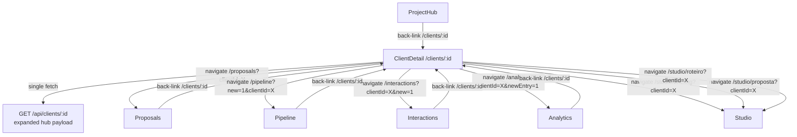

# Design Document: Client Hub Connected Workflows

## Overview

This feature transforms the `/clients/:id` page (ClientDetail) into a full hub that connects every workflow in the app to a client record. The guiding principle is **bidirectional traceability**: every action that creates or lists data tied to a client must originate *from* or link *back to* the client hub.

The work spans three layers:

1. **API** — expand `GET /api/clients/:id` to return all related data in one shot
2. **ClientDetail page** — add the missing tabs (Oportunidades, Propostas, Video Reviews), financial summary, and Studio contextual actions
3. **Destination pages** — implement the query-param pre-fill pattern and client deep-link pattern in Pipeline, Proposals, Interactions, Analytics, ProjectHub, and StudioShell

### Key Constraints

- No new routes are required; all navigation uses existing paths with query params
- Both SQLite (better-sqlite3) and Prisma (PostgreSQL) code paths must be updated in parallel
- The design system (Tailwind `frame-*` classes, shadcn/radix Tabs, orange accent `#e85002`) must be respected throughout
- i18n is handled by `useLanguage()` + `t()` — all new user-facing strings must use `t()` keys

---

## Architecture

### Current State

```
/clients/:id → ClientDetail.tsx
  - Makes: GET /api/clients/:id   → returns { client, projects, opportunities, interactions }
  - Makes: GET /api/analytics/finance → filters client entries client-side
  - Makes: GET /api/files/projects/:id (per project, up to 5)
  - No tabs for: Oportunidades, Propostas, Video Reviews
  - No: Studio actions, financial summary, deep-links outward
```

### Target State

```
/clients/:id → ClientDetail.tsx
  - Makes: GET /api/clients/:id  →  returns full hub payload (see API section)
  - Tabs: Projetos | Oportunidades | Propostas | Interações | Financeiro | Arquivos | Vídeo Reviews
  - Quick Actions: existing + Studio AI contextual actions (Briefing, Proposta, Roteiro)
  - Financial tab: summary totals header + entry list

Pipeline, Proposals, Interactions, Analytics, ProjectHub, Studio
  - All read ?clientId from URL and pre-fill / deep-link back
```

### Component Interaction Diagram



---

## Components and Interfaces

### 1. ClientDetail.tsx

**New tabs to add** (alongside existing Projetos, Interações, Arquivos, Financeiro):

| Tab value | Trigger | Data source |
|---|---|---|
| `oportunidades` | Oportunidades (N) | `detail.opportunities` from hub payload |
| `propostas` | Propostas (N) | separate `GET /api/proposals?clientId=X` fetch |
| `video-reviews` | Vídeo Reviews (N) | `detail.videoReviews` from hub payload |

**Financial tab changes**: Add a summary card row above the entry list showing:
- Total Receitas (sum of `settled` income entries)
- Total Despesas (sum of `settled` expense entries)
- Saldo Líquido (income minus expenses), colored green/red

**Studio contextual actions section** (new block in quick actions bar):

```tsx
// Three buttons navigating to /studio/:toolId?clientId={clientId}
const STUDIO_ACTIONS = [
  { toolId: "briefing",  label: "Briefing",  icon: FileText },
  { toolId: "proposta",  label: "Proposta",  icon: BriefcaseBusiness },
  { toolId: "roteiro",   label: "Roteiro",   icon: Film },
] as const;
```

**Data loading change**: Replace the two-step load (client fetch + separate finance/files fetches) with a single fetch from the expanded API endpoint. The `loadAll` function becomes:

```ts
const res = await fetch(`/api/clients/${clientId}`, { credentials: "include" });
const { data } = await res.json();
setClient(data.client);
setProjects(data.projects ?? []);
setOpportunities(data.opportunities ?? []);
setInteractions(data.interactions ?? []);
setFinancial(data.financial ?? []);
setFiles(data.files ?? []);
setVideoReviews(data.videoReviews ?? []);
```

**New state variables**:
```ts
const [opportunities, setOpportunities] = useState<OpportunityItem[]>([]);
const [videoReviews, setVideoReviews] = useState<VideoReviewItem[]>([]);
```

**New interface types** (added to ClientDetail.tsx):
```ts
interface OpportunityItem {
  id: number;
  title: string;
  stage: string;
  estimated_value: number | null;
  probability: number;
  expected_close_date: string | null;
  lost_reason: string | null;
}

interface VideoReviewItem {
  id: number;
  project_id: number;
  project_name: string;
  title: string;
  status: string;
  created_at: string;
}
```

### 2. clientsController.ts — getClient()

The controller already fetches `projects`, `opportunities`, and `interactions`. It must be extended to also fetch `financial`, `files`, and `videoReviews`.

**SQLite path** — parallel queries using `db.prepare().all()`:
```ts
const financial = db.prepare(
  `SELECT id, kind, description, amount, status, due_date, category
   FROM financial_entries WHERE client_id = ? ORDER BY due_date DESC`
).all(clientId);

// Collect project IDs first, then IN query
const projectIds = projects.map((p: any) => p.id);
let files: any[] = [];
let videoReviews: any[] = [];
if (projectIds.length > 0) {
  const placeholders = projectIds.map(() => "?").join(",");
  files = db.prepare(
    `SELECT f.id, f.original_name, f.mime_type, f.created_at, f.project_id, p.name as project_name
     FROM files f JOIN projects p ON p.id = f.project_id
     WHERE f.project_id IN (${placeholders})
     ORDER BY f.created_at DESC LIMIT 100`
  ).all(...projectIds);
  videoReviews = db.prepare(
    `SELECT vr.id, vr.project_id, p.name as project_name, vr.title, vr.status, vr.created_at
     FROM video_reviews vr JOIN projects p ON p.id = vr.project_id
     WHERE vr.project_id IN (${placeholders})
     ORDER BY vr.created_at DESC`
  ).all(...projectIds);
}
```

**Prisma path** — use `prisma.financialEntry.findMany`, `prisma.file.findMany`, `prisma.videoReview.findMany` filtered by the client's project IDs, added in the same `include`/`findMany` block after the existing query.

**Partial failure resilience** — wrap each secondary query in try/catch; collect failures into a `warnings` array:
```ts
const warnings: string[] = [];
try { financial = ...; } catch { warnings.push("financial"); financial = []; }
try { files = ...; } catch { warnings.push("files"); files = []; }
try { videoReviews = ...; } catch { warnings.push("videoReviews"); videoReviews = []; }
```

The response shape becomes:
```ts
res.json({
  success: true,
  data: {
    client,
    projects,
    opportunities,
    interactions,   // limited to 20, desc
    financial,
    files,
    videoReviews,
    ...(warnings.length ? { warnings } : {}),
  },
});
```

### 3. Pre-fill Pattern (shared across Proposals, Interactions, Analytics)

All three destination pages follow the same pattern:

```
URL: /proposals?clientId=123
         │
         ▼
useEffect on mount:
  1. Parse clientId from window.location.search (or useSearch() from wouter)
  2. If clientId is a valid integer → fetch GET /api/clients/:clientId
  3. On success → setFormField("clientId", clientId) + setFormField("clientName", data.name) etc.
  4. On failure or missing clientId → no-op (form stays empty)
```

**Wouter search params** — wouter v3 provides `useSearch()` hook returning a query string. Parse with `new URLSearchParams(useSearch())`:

```ts
import { useSearch } from "wouter";

function useClientIdFromQuery() {
  const search = useSearch();
  const params = new URLSearchParams(search);
  const raw = params.get("clientId");
  const parsed = raw ? parseInt(raw, 10) : null;
  return Number.isInteger(parsed) && parsed > 0 ? parsed : null;
}
```

This hook is used in Proposals, Interactions, and Analytics. It is also used in StudioShell.

**Proposals.tsx** — on mount, if `clientId` is present, fetch client and populate:
- `clientName` → `form.clientName`
- `company` → `form.company`
- `email` → `form.email`
- `phone` → `form.phone`
- Also auto-select the client in the client dropdown if one exists

**Interactions.tsx** — on mount, if `clientId` is present, pre-select `clientId` in the interaction form's client select dropdown. Also if `new=1` is in query params, auto-open the create dialog.

**Analytics.tsx** — on mount, if `clientId` is present, pre-set `selectedClientId` in the new entry form. Also if `newEntry=1` is in query params, auto-open the create dialog.

### 4. Deep Link Pattern (shared across Pipeline, ProjectHub, Analytics, Interactions)

Every entity card/row that has a non-null `client_id` / `clientId` must render a clickable client name badge:

```tsx
// Shared helper component — inline, no separate file needed
function ClientLink({ clientId, clientName }: { clientId: number | null; clientName?: string | null }) {
  const [, setLocation] = useLocation();
  if (!clientId || !clientName) return null;
  return (
    <button
      onClick={(e) => { e.stopPropagation(); setLocation(`/clients/${clientId}`); }}
      className="flex items-center gap-1 text-xs text-frame-orange hover:underline"
    >
      <Building2 className="w-3 h-3" />
      {clientName}
    </button>
  );
}
```

**Usage per page**:

- **ProjectHub** — below the project name heading, render `<ClientLink clientId={project.clientId} clientName={project.clientName} />`
- **Pipeline** — on each opportunity Kanban card and in the opportunity detail modal, render `<ClientLink clientId={opp.client_id} clientName={opp.client_name} />`
- **Analytics** — on each financial entry row in the list, render `<ClientLink clientId={entry.client_id} clientName={entry.client_name} />`
- **Interactions** — on each interaction row, render `<ClientLink clientId={interaction.clientId} clientName={interaction.client_name} />`

### 5. StudioShell — Client Context Injection

StudioShell already supports project-linked client context via `buildStudioLinkedContext`. The extension for the client-hub path is:

1. Parse `clientId` from query params using `useClientIdFromQuery()`
2. If `clientId` is present (no active project), fetch `GET /api/clients/:clientId`
3. Build a `StudioLinkedContext` from the client data using `buildStudioLinkedContext(slug, null, clientData)`
4. Apply the prefill to `formData` on tool load

```ts
// In StudioShell, after the project-based context block:
const clientIdParam = useClientIdFromQuery();

useEffect(() => {
  if (clientIdParam && !activeProject) {
    api.clients.get(clientIdParam).then((details) => {
      const ctx = buildStudioLinkedContext(activeToolId, null, details.client);
      setLinkedContext(ctx);
      const { merged } = mergeStudioPrefill({}, ctx?.prefill || {});
      setFormData(merged);
    }).catch(() => { /* graceful no-op */ });
  }
}, [clientIdParam, activeToolId]);
```

The `buildStudioLinkedContext` function already handles `proposta`, `briefing`, and `roteiro` slugs, mapping client `name`/`company`/`industry` to the right form fields. No changes needed to `studioContext.ts`.

**Active project context offer** (requirement 9.5-9.6): if the fetched client has projects with status not in `['archived', 'cancelled']`, StudioShell offers the most recently created one via the existing `linkedContext` "Apply context" button already in the UI. The `linkedContext.sourceLabel` is updated to show the project name when selected.

---

## Data Models

### Extended API Response Shape

`GET /api/clients/:id` response after this feature:

```ts
interface ClientHubPayload {
  client: ClientRecord;
  projects: ProjectSummary[];       // all, desc by created_at
  opportunities: OpportunityRecord[]; // all, desc by updated_at
  interactions: InteractionRecord[]; // top 20, desc by created_at
  financial: FinancialEntry[];       // all, desc by due_date
  files: FileWithProject[];          // up to 100, desc by created_at
  videoReviews: VideoReviewRecord[]; // all, desc by created_at
  warnings?: string[];               // sections that failed to load
}

interface ProjectSummary {
  id: number;
  name: string;
  status: string;
  created_at: string;
}

interface OpportunityRecord {
  id: number;
  title: string;
  stage: string;
  estimated_value: number | null;
  probability: number;
  expected_close_date: string | null;
  lost_reason: string | null;
}

interface InteractionRecord {
  id: number;
  type: string;
  subject: string | null;
  notes: string | null;
  created_at: string;
}

interface FinancialEntry {
  id: number;
  kind: "income" | "expense";
  description: string;
  amount: number;
  status: "pending" | "settled" | "canceled";
  due_date: string | null;
  category: string;
}

interface FileWithProject {
  id: number;
  original_name: string;
  mime_type: string | null;
  created_at: string;
  project_id: number;
  project_name: string;
}

interface VideoReviewRecord {
  id: number;
  project_id: number;
  project_name: string;
  title: string;
  status: string;
  created_at: string;
}
```

### Financial Summary Computation (client-side)

The summary totals are computed in the component, not the API:

```ts
const financialSummary = useMemo(() => {
  const totalIncome = financial
    .filter(e => e.kind === "income" && e.status === "settled")
    .reduce((sum, e) => sum + e.amount, 0);
  const totalExpenses = financial
    .filter(e => e.kind === "expense" && e.status === "settled")
    .reduce((sum, e) => sum + e.amount, 0);
  return { totalIncome, totalExpenses, netBalance: totalIncome - totalExpenses };
}, [financial]);
```

---

## Correctness Properties

*A property is a characteristic or behavior that should hold true across all valid executions of a system — essentially, a formal statement about what the system should do. Properties serve as the bridge between human-readable specifications and machine-verifiable correctness guarantees.*

**Property reflection notes**: Requirements 2.1/3.1/5.1 all express ordering invariants consolidated by data type. Requirements 2.3/3.3/4.1/5.2/6.3/9.2 share the same navigation-URL pattern, merged into Property 6. Requirements 11.1–11.4 share the same entity-link pattern, merged into Property 7 (complement covered by the same property). Requirements 10.6, 6.2 remain standalone.

---

### Property 1: Hub payload always contains all seven sections

*For any* valid client ID belonging to the authenticated user, the API response data object SHALL contain all seven keys: `client`, `projects`, `opportunities`, `interactions`, `financial`, `files`, and `videoReviews`.

**Validates: Requirements 10.1**

---

### Property 2: Hub payload filtering correctness

*For any* client C, every item returned in `opportunities`, `interactions`, `financial`, `files`, and `videoReviews` SHALL be associated with client C (directly via `client_id`, or transitively via a project that belongs to C). No item from another client SHALL appear in any section.

**Validates: Requirements 2.4, 3.2, 6.1, 6.5, 7.1, 8.3, 10.3, 10.4, 10.5**

---

### Property 3: Interactions are limited to 20 and ordered descending

*For any* client C, the `interactions` array in the hub payload SHALL have length ≤ 20, and if it contains more than one item, each item's `created_at` SHALL be greater than or equal to the next item's `created_at`.

**Validates: Requirements 5.1, 5.5**

---

### Property 4: Files are capped at 100 and ordered descending

*For any* client C whose projects contain files, the `files` array SHALL have length ≤ 100, and if it contains more than one item, each item's `created_at` SHALL be greater than or equal to the next item's `created_at`.

**Validates: Requirements 7.1**

---

### Property 5: Financial summary math is always correct

*For any* collection of financial entries shown in the Financeiro tab, the displayed `totalIncome` SHALL equal the sum of `amount` for all entries where `kind = "income"` AND `status = "settled"`, the displayed `totalExpenses` SHALL equal the sum of `amount` where `kind = "expense"` AND `status = "settled"`, and the displayed `netBalance` SHALL equal `totalIncome - totalExpenses`.

**Validates: Requirements 6.2**

---

### Property 6: Navigation URLs always include clientId

*For any* quick action button in the Client Hub (Gerar Proposta, Nova Oportunidade, Registrar Interação, Lançar Receita/Despesa, Studio actions), for any clientId N, the URL navigated to SHALL contain the string `clientId=N` as a query parameter.

**Validates: Requirements 2.3, 3.3, 4.1, 5.2, 6.3, 9.2**

---

### Property 7: Client link renders for entities with clientId and is absent when null

*For any* entity (project, opportunity, financial entry, interaction) with a non-null `client_id`:
- The rendered output SHALL contain an anchor or button element with a route pointing to `/clients/{client_id}`.

*For any* entity with a null or undefined `client_id`:
- The rendered output SHALL NOT contain any element with an href or onClick routing to a `/clients/` path.

**Validates: Requirements 11.1, 11.2, 11.3, 11.4, 11.5**

---

### Property 8: Pre-fill populates form fields for valid clientId

*For any* destination page (Proposals, Interactions, Analytics) receiving a valid `clientId` query parameter N, the form field values that correspond to the client (name, company, email, phone, or the client select field) SHALL match the data returned by `GET /api/clients/N` for the authenticated user.

**Validates: Requirements 4.2, 5.3, 6.4**

---

### Property 9: Partial failure resilience — client always present in response

*For any* combination of secondary data query failures (financial, files, videoReviews), the API response SHALL still include the `client` object with HTTP 200, and any failed section SHALL appear as an empty array `[]`. The `warnings` array SHALL list the names of all sections that failed.

**Validates: Requirements 10.6**

---

### Property 10: Studio context injection preserves non-null fields only

*For any* client object fetched for Studio pre-fill, only fields with non-null and non-empty string values SHALL be merged into the generation context. A field with a null or empty value SHALL NOT overwrite any existing form field value.

**Validates: Requirements 9.3**

---

## Error Handling

### API Layer

| Scenario | Behavior |
|---|---|
| Client not found or wrong user | `AppError("Cliente não encontrado ou acesso não autorizado", 404)` — same as current |
| Secondary query failure (financial, files, videoReviews) | Catch per section, return partial payload with `warnings` array |
| Invalid `clientId` param (non-integer) | `AppError("Cliente inválido", 400)` via `clientBigInt()` helper (already exists) |
| DB timeout / overload | Express error middleware returns 500 |

### Frontend Layer

| Scenario | Behavior |
|---|---|
| Hub fetch fails | `toast.error(...)`, show empty state in each tab, not a full page crash |
| `warnings` array present in response | Silent handling — tabs that failed load empty state (no user-visible error for secondary data) |
| Pre-fill client fetch fails | No-op — form stays empty, no error shown to user |
| Studio client fetch fails (invalid `clientId`) | `buildStudioLinkedContext` called with null client, no prefill applied, no error shown |
| `clientId` query param is not a valid integer | `useClientIdFromQuery()` returns null, pre-fill is skipped |

---

## Testing Strategy

### Unit Tests

Cover specific behaviors and edge cases with example-based tests:

- `useClientIdFromQuery()` — returns null for missing, non-numeric, negative, and float strings; returns integer for valid positive integer strings
- `financialSummary` computation — test with empty array, all income, all expenses, mixed settled/pending/canceled
- `ClientLink` component — renders link when clientId is present and name is provided; renders nothing when either is null
- `buildStudioLinkedContext` — returns null when both project and client are null; returns correct prefill when only client is provided
- API `getClient` — returns 404 when client doesn't belong to user

### Property-Based Tests

Using [fast-check](https://github.com/dubzzz/fast-check) for TypeScript property tests (minimum 100 iterations each).

**Property 1: Hub payload completeness**
```
Feature: client-hub-connected-workflows, Property 1: Hub payload always contains all seven sections
```
Generate arbitrary client IDs (mocked DB), assert response always has all seven keys.

**Property 2: Filtering correctness**
```
Feature: client-hub-connected-workflows, Property 2: Hub payload filtering correctness
```
Generate clients with N projects (and associated data for other clients), assert all returned items belong only to the queried client.

**Property 3: Interactions limit and ordering**
```
Feature: client-hub-connected-workflows, Property 3: Interactions are limited to 20 and ordered descending
```
Generate arbitrary interaction lists of varying lengths (0–200), assert length ≤ 20 and descending order.

**Property 4: Files cap and ordering**
```
Feature: client-hub-connected-workflows, Property 4: Files are capped at 100 and ordered descending
```
Generate arbitrary file lists (0–500), assert length ≤ 100 and descending order.

**Property 5: Financial summary math**
```
Feature: client-hub-connected-workflows, Property 5: Financial summary math is always correct
```
Generate arbitrary arrays of `FinancialEntry` objects (varying kind, status, amount), assert computed totals match hand-calculated expected values. This is a pure function test — ideal for PBT.

**Property 6: Navigation URLs always include clientId**
```
Feature: client-hub-connected-workflows, Property 6: Navigation URLs always include clientId
```
Generate arbitrary positive integer clientIds, render the ClientDetail quick-action buttons, assert every `setLocation` call contains `clientId=${N}`.

**Property 7: Client link conditional rendering**
```
Feature: client-hub-connected-workflows, Property 7: Client link renders for entities with clientId
```
Generate arbitrary entity objects with random `client_id` values (including null), assert `ClientLink` renders an anchor iff `clientId` is non-null and `clientName` is non-empty.

**Property 8: Pre-fill populates form fields**
```
Feature: client-hub-connected-workflows, Property 8: Pre-fill populates form fields for valid clientId
```
Generate arbitrary client objects, simulate page load with `?clientId=N`, mock the client API to return the generated client, assert form fields match client data.

**Property 9: Partial failure resilience**
```
Feature: client-hub-connected-workflows, Property 9: Partial failure resilience
```
Generate arbitrary subsets of `{financial, files, videoReviews}` to fail, assert response always has `client`, failed sections are `[]`, and `warnings` lists exactly the failed sections.

**Property 10: Studio context injection**
```
Feature: client-hub-connected-workflows, Property 10: Studio context injection preserves non-null fields only
```
Generate arbitrary client objects with randomly null/empty/populated fields, apply `buildStudioLinkedContext`, assert no null/empty values appear in the prefill output.

### Integration Tests

- `GET /api/clients/:id` response time ≤ 2000ms with realistic seeded data (50 projects, 200 financial entries per client)
- End-to-end navigation flow: ClientDetail → Proposals page → form has pre-filled client data
- StudioShell: loads with `?clientId=X` and context panel shows client name in sourceLabel
