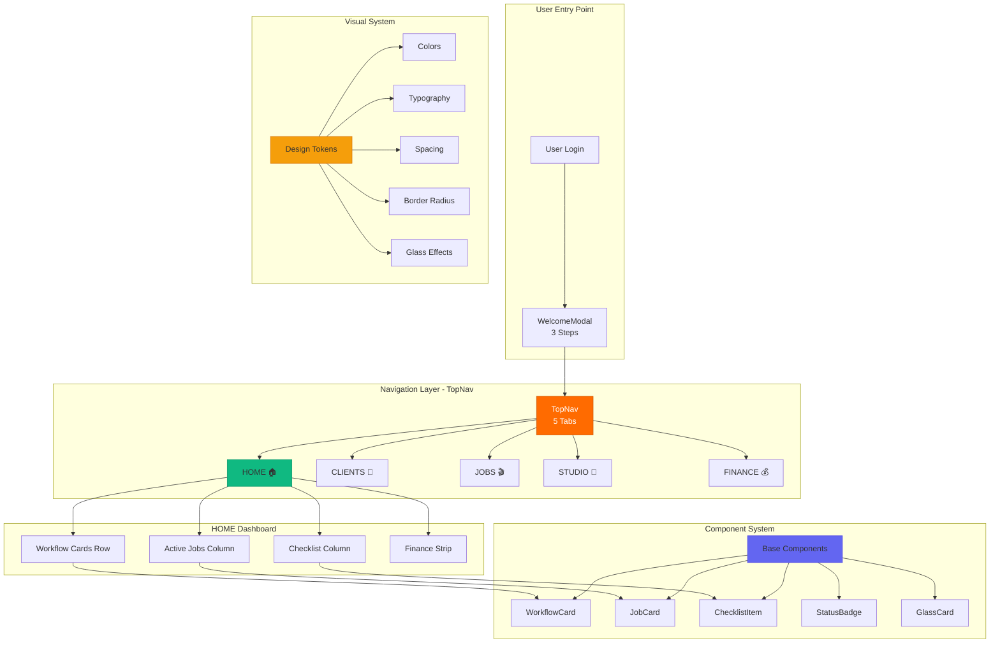
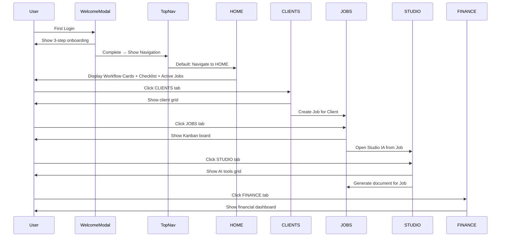
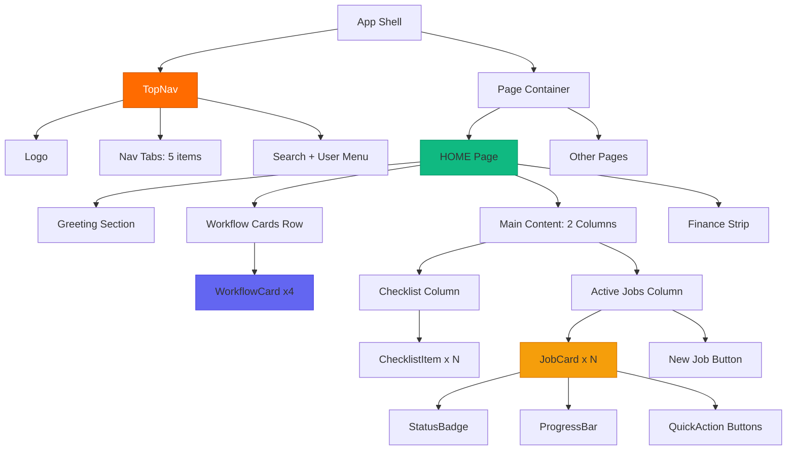

# Design Document: REBRAND FASE 1 - FUNDAÇÃO

## Overview

This design specification details Phase 1 of the Cena Studio Platform rebrand, focusing on foundational UX/UI improvements that establish clear navigation, visual storytelling, and the Liquid Glass aesthetic. The rebrand transforms a confusing production management platform into an intuitive workflow-guided experience where Studio IA (AI tools) is prominently visible, navigation is streamlined from 7+ items to 5 clear tabs, and the HOME dashboard tells a visual story instead of displaying generic information.

**Core Problem**: Users get lost because Studio IA is hidden in a "MORE" menu, navigation is cluttered with 7+ items, the dashboard provides no workflow guidance, and there's no visual hierarchy showing the production journey from client intake to delivery.

**Solution**: Implement a storytelling-driven interface with 5-tab navigation (HOME, CLIENTS, JOBS, STUDIO, FINANCE), a 3-column HOME layout featuring workflow cards and contextual checklists, a redesigned 3-step WelcomeModal aligned with the new structure, and base components using the Liquid Glass aesthetic (glassmorphism + 24-32px rounded borders).

**Design Principles**:
- "Show, don't tell" - Visual hierarchy over text
- Storytelling workflow: Cliente → Job → Studio IA → Produção → Entrega
- Liquid Glass aesthetic (glassmorphism with backdrop-blur)
- Rounded borders (24-32px border radius)
- Orange accent (#FF6B00) for primary actions
- White theme support (#FAFAFA backgrounds)

---

## Architecture

### System Architecture Diagram



### Navigation Flow Diagram



### Component Hierarchy



---

## Components and Interfaces

### 1. TopNav Component

**Purpose**: Primary navigation providing access to all 5 main sections with constant visibility and glassmorphism aesthetic.

**Interface**:
```typescript
interface TopNavProps {
  currentPath: string
  user: UserProfile
  onNavigate: (path: string) => void
  onSearch: (query: string) => void
  theme: 'light' | 'dark'
}

interface NavTab {
  id: string
  label: string
  icon: string
  path: string
  isActive: boolean
}

interface UserProfile {
  name: string
  email: string
  avatar?: string
  plan: 'free' | 'pro' | 'studio'
}
```

**Responsibilities**:
- Display 5 navigation tabs (HOME, CLIENTS, JOBS, STUDIO, FINANCE)
- Highlight active tab based on current route
- Provide search functionality via Cmd+K shortcut
- Show user profile menu with plan indicator
- Apply glassmorphism effect with backdrop-blur
- Remain fixed at top during scroll

**Visual Wireframe**:
```
┌────────────────────────────────────────────────────────────────────┐
│ Glass Nav Bar (fixed top, backdrop-blur-30)                       │
├────────────────────────────────────────────────────────────────────┤
│ 🎬 cena.                                                           │
│                                                                    │
│  [🏠 HOME]  [👥 CLIENTS]  [🎬 JOBS]  [🤖 STUDIO]  [💰 FINANCE]   │
│  ━━━━━━━━                                                         │
│  (active orange underline)                                         │
│                                                                    │
│                              🔍 Search   [Free ⚡]  👤 Does  ⚙️    │
└────────────────────────────────────────────────────────────────────┘
```

**State Management**:
- `activeTab`: string - Current active navigation tab
- `searchOpen`: boolean - Search modal visibility
- `userMenuOpen`: boolean - User dropdown menu visibility

---

### 2. HOME Dashboard Component

**Purpose**: Central command center displaying daily workflow overview, active jobs, pending tasks, and quick actions in a 3-column storytelling layout.

**Interface**:
```typescript
interface HOMEDashboardProps {
  user: UserProfile
  workflowStats: WorkflowStats
  checklist: ChecklistItem[]
  activeJobs: Job[]
  financeStrip: FinanceSummary
  onCreateJob: () => void
  onNavigate: (path: string) => void
}

interface WorkflowStats {
  activeJobs: number
  clientsWaiting: number
  reviewsPending: number
}

interface ChecklistItem {
  id: string
  text: string
  checked: boolean
  link?: string
  dueDate?: Date
}

interface Job {
  id: string
  title: string
  client: string
  status: 'briefing' | 'production' | 'review' | 'delivered'
  deadline: Date
  daysLeft: number
  progress: number
  urgent: boolean
}

interface FinanceSummary {
  monthlyRevenue: number
  jobsCompleted: number
  currency: string
}
```

**Responsibilities**:
- Display personalized greeting with context (time of day, pending actions)
- Show 4 workflow cards as quick-access navigation
- Present daily checklist with actionable items
- Display active jobs with visual status indicators
- Show financial summary strip at bottom
- Handle transitions to detailed views when cards are clicked

**Visual Wireframe**:
```
┌─────────────────────────────────────────────────────────────────┐
│  HOME                                      🔍 Command + K        │
├─────────────────────────────────────────────────────────────────┤
│                                                                   │
│  Bom dia, Does! 🎬                                               │
│  Você tem 3 ações pendentes hoje.                               │
│                                                                   │
│  ┌───────────────────────────────────────────────────────────┐  │
│  │  🎯 SEU WORKFLOW HOJE                                      │  │
│  │                                                             │  │
│  │  [📊 2 JOBS]  [👤 1 CLIENT]  [🎥 3 REVIEWS]  [🤖 STUDIO] │  │
│  │   Ativos       Aguardando     Pendentes      Ferramentas  │  │
│  └───────────────────────────────────────────────────────────┘  │
│                                                                   │
│  ┌──────────────────┐  ┌───────────────────────────────────┐   │
│  │ 📋 HOJE          │  │ 🎬 JOBS ATIVOS                    │   │
│  │                  │  │                                    │   │
│  │ ☐ Briefing Job X │  │  ┌─────────────┐ ┌─────────────┐│   │
│  │ ☐ Review vídeo Y │  │  │ JOB CARD    │ │ JOB CARD    ││   │
│  │ ☐ Enviar proposta│  │  │ Status: 🟡  │ │ Status: 🟢  ││   │
│  │                  │  │  │ 5 dias left │ │ Concluído   ││   │
│  │ [+ Adicionar]    │  │  └─────────────┘ └─────────────┘│   │
│  │                  │  │                                    │   │
│  └──────────────────┘  │  [+ NOVO JOB]                     │   │
│                         └───────────────────────────────────┘   │
│                                                                   │
│  💰 R$ 12.500 este mês • 3 jobs faturados → Ver Finance         │
│                                                                   │
└─────────────────────────────────────────────────────────────────┘
```

**Layout Structure**:
1. **Header Section**: Greeting + context message
2. **Workflow Cards Row**: 4 glass cards (Jobs, Clients, Reviews, Studio)
3. **Main Content**: 2-column grid
   - Left: Checklist (30% width)
   - Right: Active Jobs (70% width)
4. **Footer Strip**: Financial summary (single line)

---

### 3. WorkflowCard Component

**Purpose**: Quick-access navigation cards showing key metrics and providing one-click navigation to major sections.

**Interface**:
```typescript
interface WorkflowCardProps {
  icon: string
  count: number
  label: string
  sublabel: string
  status: 'active' | 'warning' | 'neutral' | 'success'
  onClick: () => void
}
```

**Responsibilities**:
- Display metric with large number typography
- Show icon and descriptive label
- Provide visual status indication via border color
- Animate on hover (lift effect)
- Navigate to relevant section on click

**Visual Design**:
```
┌─────────────────────┐
│  📊                 │
│                     │
│  2                  │  ← Large number (3rem, bold)
│  JOBS ATIVOS        │  ← Label (uppercase, 0.75rem)
│  Ver todos          │  ← Sublabel (muted)
│                     │
└─────────────────────┘
Glass card with:
- border-radius: 24px
- backdrop-filter: blur(20px)
- Hover: translateY(-4px) + shadow increase
```

**Pseudo-code**:
```pascal
COMPONENT WorkflowCard(icon, count, label, sublabel, status, onClick)

  RENDER GlassCard WITH
    className ← "workflow-card glass-card-" + status
    padding ← "24px"
    borderRadius ← "24px"
    cursor ← "pointer"

  ON_HOVER
    transform ← "translateY(-4px)"
    boxShadow ← "0 16px 48px rgba(0,0,0,0.12)"

  ON_CLICK
    CALL onClick()
    ANIMATE transition ← "scale(0.95)"

  DISPLAY
    Icon WITH fontSize ← "2rem"
    Count WITH fontSize ← "3rem", fontWeight ← "bold"
    Label WITH fontSize ← "0.75rem", textTransform ← "uppercase"
    Sublabel WITH fontSize ← "0.875rem", color ← "muted"
END COMPONENT
```

---

### 4. JobCard Component

**Purpose**: Visual representation of a job/project showing status, deadline, progress, client, and quick actions.

**Interface**:
```typescript
interface JobCardProps {
  job: Job
  onQuickAction: (action: string, jobId: string) => void
  onCardClick: (jobId: string) => void
}

interface Job {
  id: string
  title: string
  client: string
  status: 'briefing' | 'production' | 'review' | 'delivered'
  deadline: Date
  daysLeft: number
  progress: number
  urgent: boolean
}
```

**Responsibilities**:
- Display job information in scannable format
- Show visual progress bar
- Indicate urgency via color coding (red if < 3 days)
- Provide quick action buttons (Briefing, Review, Hub)
- Navigate to job details on card click
- Apply status-specific border colors

**Visual Design**:
```
┌───────────────────────────────┐
│ 🎬 COMERCIAL PRODUTO X        │  ← Title (1.5rem, bold)
│                               │
│ Cliente: ABC Prod             │  ← Metadata
│ Deadline: 15 Jan (5 dias) 🔴  │  ← Deadline with urgency indicator
│                               │
│ ████████░░ 80%                │  ← Progress bar
│                               │
│ [Briefing] [Review] [Hub]     │  ← Quick actions
└───────────────────────────────┘

Border colors by status:
- briefing: yellow (#f59e0b)
- production: orange (#FF6B00)
- review: blue (#3b82f6)
- delivered: green (#10b981)
```

**Pseudo-code with Formal Specifications**:
```pascal
COMPONENT JobCard(job, onQuickAction, onCardClick)
  PRECONDITION: job IS NOT NULL AND job.id IS valid string
  POSTCONDITION: Component renders valid HTML with correct status styles

  SEQUENCE
    statusColor ← determineStatusColor(job.status)
    urgencyColor ← IF job.daysLeft < 3 THEN "red" ELSE "default"
    borderStyle ← "2px solid " + statusColor

    RENDER GlassCard WITH
      borderRadius ← "24px"
      border ← borderStyle
      padding ← "20px"
      cursor ← "pointer"
      onClick ← () => onCardClick(job.id)

    DISPLAY
      Icon "🎬" + job.title WITH fontWeight ← "bold"
      "Cliente: " + job.client
      "Deadline: " + formatDate(job.deadline) +
        " (" + job.daysLeft + " dias) " +
        (IF job.urgent THEN "🔴" ELSE "")

      ProgressBar WITH
        value ← job.progress
        max ← 100
        color ← statusColor
        height ← "8px"
        borderRadius ← "999px"

      QuickActionsRow WITH
        Button "Briefing" onClick ← () => onQuickAction("briefing", job.id)
        Button "Review" onClick ← () => onQuickAction("review", job.id)
        Button "Hub" onClick ← () => onQuickAction("hub", job.id)
  END SEQUENCE

FUNCTION determineStatusColor(status: string) RETURNS string
  PRECONDITION: status IN ['briefing', 'production', 'review', 'delivered']
  POSTCONDITION: Returns valid hex color code

  MATCH status WITH
    CASE "briefing" RETURN "#f59e0b"
    CASE "production" RETURN "#FF6B00"
    CASE "review" RETURN "#3b82f6"
    CASE "delivered" RETURN "#10b981"
    DEFAULT RETURN "#6b7280"
  END MATCH
END FUNCTION
```

---

### 5. WelcomeModal Component

**Purpose**: Onboarding flow that introduces new users to the 5-tab navigation structure and core workflow in 3 progressive steps.

**Interface**:
```typescript
interface WelcomeModalProps {
  user: UserProfile
  onComplete: () => void
  onSkip: () => void
  onCreateDemoJob?: () => void
}

interface WelcomeModalState {
  currentStep: 1 | 2 | 3
  canProgress: boolean
  neverShowAgain: boolean
}
```

**Responsibilities**:
- Show 3-step progressive onboarding
- Step 1: Welcome + Introduction
- Step 2: Navigation Map (visual diagram of 5 tabs)
- Step 3: Workflow explanation with CTA options
- Provide skip option at any step
- Offer "Create Demo Job" quick-start option
- Save "never show again" preference

**Visual Design - Step 1**:
```
┌─────────────────────────────────────────────────────────┐
│  ✨                                                      │
│                                                          │
│  OLÁ, DOES!                                             │
│                                                          │
│  Bem-vindo ao Cena Studio.                              │
│  Feito por filmmakers para filmmakers.                  │
│                                                          │
│  Esta é sua plataforma completa de produção             │
│  audiovisual com inteligência artificial.               │
│                                                          │
│  Vamos te guiar em 3 passos simples.                   │
│                                                          │
│  [PULAR TOUR] [COMEÇAR →]                               │
└─────────────────────────────────────────────────────────┘
```

**Visual Design - Step 2**:
```
┌─────────────────────────────────────────────────────────┐
│  🗺️ SUA NAVEGAÇÃO                                       │
│                                                          │
│  [🏠]─────[👥]─────[🎬]─────[🤖]─────[💰]             │
│  HOME    CLIENTS   JOBS    STUDIO   FINANCE             │
│   │        │        │        │         │                │
│   │        │        │        │         │                │
│  Seu     Carteira  Pipeline  IA      Dinheiro           │
│  radar   clientes  produção  tools   estúdio            │
│                                                          │
│  💡 DICA: Studio IA está sempre visível no topo!        │
│                                                          │
│  [← VOLTAR] [PRÓXIMO →]                                 │
└─────────────────────────────────────────────────────────┘
```

**Visual Design - Step 3**:
```
┌─────────────────────────────────────────────────────────┐
│  🎬 SEU WORKFLOW                                        │
│                                                          │
│  1. CLIENTE → Cadastre na aba CLIENTS                   │
│              [Ir para Clients]                           │
│                                                          │
│  2. JOB → Crie um job na aba JOBS                       │
│           [Criar Job]                                    │
│                                                          │
│  3. STUDIO → Use IA para roteiro, briefing, docs        │
│              [Abrir Studio]                              │
│                                                          │
│  4. ENTREGA → Review, aprovação, faturamento            │
│                                                          │
│  OU → Criar Job Demo (dados prontos)                    │
│       [Criar Demo]                                       │
│                                                          │
│  [← VOLTAR] [COMEÇAR! 🚀]                               │
└─────────────────────────────────────────────────────────┘
```

**Pseudo-code with State Management**:
```pascal
COMPONENT WelcomeModal(user, onComplete, onSkip, onCreateDemoJob)
  PRECONDITION: user IS authenticated AND user.firstLogin = true
  POSTCONDITION: User completes onboarding OR skips with preference saved

  STATE
    currentStep ← 1
    neverShowAgain ← false
  END STATE

  FUNCTION nextStep()
    PRECONDITION: currentStep < 3
    POSTCONDITION: currentStep increases by 1

    IF currentStep < 3 THEN
      currentStep ← currentStep + 1
    END IF
  END FUNCTION

  FUNCTION previousStep()
    PRECONDITION: currentStep > 1
    POSTCONDITION: currentStep decreases by 1

    IF currentStep > 1 THEN
      currentStep ← currentStep - 1
    END IF
  END FUNCTION

  FUNCTION handleComplete()
    PRECONDITION: Modal is open
    POSTCONDITION: Modal closes AND preference saved

    CALL saveUserPreference("welcomeModalCompleted", true)
    IF neverShowAgain THEN
      CALL saveUserPreference("neverShowWelcome", true)
    END IF
    CALL onComplete()
  END FUNCTION

  FUNCTION handleSkip()
    PRECONDITION: Modal is open
    POSTCONDITION: Modal closes AND skip preference saved

    CALL saveUserPreference("welcomeModalSkipped", true)
    CALL onSkip()
  END FUNCTION

  RENDER Modal WITH backdrop-blur
    MATCH currentStep WITH
      CASE 1: DISPLAY Step1Content(user.name, nextStep, handleSkip)
      CASE 2: DISPLAY Step2Content(nextStep, previousStep, handleSkip)
      CASE 3: DISPLAY Step3Content(handleComplete, previousStep, onCreateDemoJob)
    END MATCH

    DISPLAY ProgressIndicator WITH
      currentStep ← currentStep
      totalSteps ← 3
      style ← "dots"
  END RENDER
END COMPONENT
```

---

### 6. Base Glass Components

**Purpose**: Foundational UI components implementing the Liquid Glass aesthetic (glassmorphism + rounded borders).

#### GlassCard Component

**Interface**:
```typescript
interface GlassCardProps {
  children: ReactNode
  variant?: 'light' | 'dark'
  padding?: 'sm' | 'md' | 'lg'
  borderRadius?: 'md' | 'lg' | 'xl' | '2xl'
  hover?: boolean
  onClick?: () => void
}
```

**CSS Specifications**:
```css
/* Base Glass Card */
.glass-card {
  background: rgba(255, 255, 255, 0.7);
  backdrop-filter: blur(20px) saturate(180%);
  -webkit-backdrop-filter: blur(20px) saturate(180%);
  border: 1px solid rgba(0, 0, 0, 0.08);
  box-shadow: 0 8px 32px rgba(0, 0, 0, 0.08);
  transition: all 300ms cubic-bezier(0.4, 0, 0.2, 1);
}

/* Border Radius Variants */
.glass-card-md { border-radius: 12px; }
.glass-card-lg { border-radius: 16px; }
.glass-card-xl { border-radius: 24px; }
.glass-card-2xl { border-radius: 32px; }

/* Hover Effect */
.glass-card-hover:hover {
  transform: translateY(-4px);
  box-shadow: 0 16px 48px rgba(0, 0, 0, 0.12);
}

/* Dark Variant */
.glass-card-dark {
  background: rgba(10, 10, 10, 0.6);
  border: 1px solid rgba(255, 255, 255, 0.18);
  box-shadow: 0 8px 32px rgba(0, 0, 0, 0.3);
}
```

#### StatusBadge Component

**Interface**:
```typescript
interface StatusBadgeProps {
  type: 'success' | 'warning' | 'danger' | 'info' | 'neutral'
  text: string
  icon?: string
  pulse?: boolean
  size?: 'sm' | 'md' | 'lg'
}
```

**Visual Examples**:
```
Success:  [✓ Concluído]     Green (#10b981)
Warning:  [⏳ Pendente]     Yellow (#f59e0b)
Danger:   [🔴 Urgente]      Red (#ef4444)
Info:     [ℹ️ Em análise]   Blue (#3b82f6)
Neutral:  [⚪ Aguardando]   Gray (#6b7280)
```

**Pseudo-code**:
```pascal
COMPONENT StatusBadge(type, text, icon, pulse, size)
  PRECONDITION: type IN ['success', 'warning', 'danger', 'info', 'neutral']
  POSTCONDITION: Renders pill-shaped badge with correct semantic colors

  colorMap ← {
    success: "#10b981",
    warning: "#f59e0b",
    danger: "#ef4444",
    info: "#3b82f6",
    neutral: "#6b7280"
  }

  backgroundColor ← colorMap[type] WITH alpha ← 0.1
  borderColor ← colorMap[type] WITH alpha ← 0.3
  textColor ← colorMap[type]

  RENDER Pill WITH
    background ← backgroundColor
    border ← "1px solid " + borderColor
    borderRadius ← "999px"
    padding ← determinePadding(size)
    color ← textColor
    fontSize ← determineFontSize(size)
    fontWeight ← "700"

  IF pulse = true THEN
    animation ← "pulse 2s infinite"
  END IF

  DISPLAY
    IF icon THEN icon + " " END IF
    text
END COMPONENT
```

---

## Data Models

### UserProfile Model

```typescript
interface UserProfile {
  id: string
  name: string
  email: string
  avatar?: string
  plan: 'free' | 'pro' | 'studio'
  firstLogin: boolean
  preferences: UserPreferences
  createdAt: Date
  lastLoginAt: Date
}

interface UserPreferences {
  theme: 'light' | 'dark' | 'auto'
  welcomeModalCompleted: boolean
  neverShowWelcome: boolean
  defaultView: 'home' | 'jobs' | 'clients'
  language: 'pt-BR' | 'en-US'
}
```

**Validation Rules**:
- `id` must be unique UUID v4
- `email` must be valid email format
- `name` must be 2-100 characters
- `plan` defaults to 'free' on account creation
- `firstLogin` is true until user completes onboarding
- `preferences.theme` defaults to 'auto'

---

### Job Model

```typescript
interface Job {
  id: string
  title: string
  clientId: string
  client: string // Denormalized for display
  status: JobStatus
  deadline: Date
  createdAt: Date
  updatedAt: Date
  progress: number // 0-100
  urgent: boolean // Auto-calculated
  daysLeft: number // Auto-calculated
  tags: string[]
  budget?: number
  currency: string
}

type JobStatus = 'briefing' | 'production' | 'review' | 'delivered' | 'proposal'
```

**Validation Rules**:
- `title` must be 3-200 characters
- `deadline` must be future date
- `progress` must be 0-100 integer
- `urgent` = true when daysLeft < 3
- `daysLeft` = Math.ceil((deadline - Date.now()) / (1000 * 60 * 60 * 24))
- `status` transitions: proposal → briefing → production → review → delivered
- `currency` defaults to 'BRL'

**Business Logic**:
```pascal
FUNCTION calculateUrgency(deadline: Date) RETURNS boolean
  PRECONDITION: deadline IS valid future date
  POSTCONDITION: Returns true if deadline is within 3 days

  currentDate ← Date.now()
  daysLeft ← Math.ceil((deadline - currentDate) / (1000 * 60 * 60 * 24))

  IF daysLeft < 3 THEN
    RETURN true
  ELSE
    RETURN false
  END IF
END FUNCTION

FUNCTION canTransitionStatus(currentStatus: JobStatus, newStatus: JobStatus) RETURNS boolean
  PRECONDITION: Both status values are valid JobStatus types
  POSTCONDITION: Returns true if transition is allowed

  validTransitions ← {
    "proposal": ["briefing"],
    "briefing": ["production", "proposal"],
    "production": ["review", "briefing"],
    "review": ["delivered", "production"],
    "delivered": []
  }

  IF newStatus IN validTransitions[currentStatus] THEN
    RETURN true
  ELSE
    RETURN false
  END IF
END FUNCTION
```

---

### WorkflowStats Model

```typescript
interface WorkflowStats {
  activeJobs: number
  clientsWaiting: number
  reviewsPending: number
  totalClients: number
  completedThisMonth: number
  revenueThisMonth: number
  currency: string
}
```

**Calculation Logic**:
```pascal
FUNCTION calculateWorkflowStats(jobs: Job[], clients: Client[]) RETURNS WorkflowStats
  PRECONDITION: jobs and clients are valid arrays
  POSTCONDITION: Returns accurate statistics for current user

  currentMonth ← Date.now().getMonth()
  currentYear ← Date.now().getFullYear()

  activeJobs ← COUNT jobs WHERE status IN ['briefing', 'production', 'review']

  clientsWaiting ← COUNT DISTINCT jobs.clientId
    WHERE status = 'proposal' OR status = 'briefing'

  reviewsPending ← COUNT jobs WHERE status = 'review'

  totalClients ← COUNT clients

  completedThisMonth ← COUNT jobs
    WHERE status = 'delivered'
    AND MONTH(updatedAt) = currentMonth
    AND YEAR(updatedAt) = currentYear

  revenueThisMonth ← SUM jobs.budget
    WHERE status = 'delivered'
    AND MONTH(updatedAt) = currentMonth
    AND YEAR(updatedAt) = currentYear

  RETURN WorkflowStats {
    activeJobs: activeJobs,
    clientsWaiting: clientsWaiting,
    reviewsPending: reviewsPending,
    totalClients: totalClients,
    completedThisMonth: completedThisMonth,
    revenueThisMonth: revenueThisMonth,
    currency: "BRL"
  }
END FUNCTION
```

---

## Algorithmic Pseudocode

### Navigation State Management Algorithm

```pascal
ALGORITHM manageNavigationState(currentPath, navigationTabs)
INPUT: currentPath: string, navigationTabs: NavTab[]
OUTPUT: updatedTabs: NavTab[] with correct active states

PRECONDITION: currentPath is valid route path
POSTCONDITION: Exactly one tab has isActive = true

BEGIN
  // Step 1: Normalize path to tab identifier
  tabId ← extractTabIdFromPath(currentPath)

  // Step 2: Update active states
  FOR each tab IN navigationTabs DO
    INVARIANT: All previously processed tabs have correct isActive state

    IF tab.id = tabId THEN
      tab.isActive ← true
    ELSE
      tab.isActive ← false
    END IF
  END FOR

  // Step 3: Validate single active tab
  activeCount ← COUNT tabs WHERE isActive = true
  ASSERT activeCount = 1

  RETURN navigationTabs
END

FUNCTION extractTabIdFromPath(path: string) RETURNS string
  PRECONDITION: path is non-empty string starting with '/'
  POSTCONDITION: Returns valid tab identifier or 'home' as default

  pathSegments ← SPLIT(path, '/')
  firstSegment ← pathSegments[1] // Index 0 is empty string before first /

  validTabs ← ['home', 'clients', 'jobs', 'studio', 'finance']

  IF firstSegment IN validTabs THEN
    RETURN firstSegment
  ELSE
    RETURN 'home' // Default fallback
  END IF
END FUNCTION
```

**Loop Invariants**:
- After each iteration, all processed tabs have isActive properly set
- No tab changes state after being processed
- Tab order remains stable throughout iteration

---

### HOME Dashboard Data Loading Algorithm

```pascal
ALGORITHM loadHOMEDashboardData(userId)
INPUT: userId: string
OUTPUT: dashboardData: HOMEDashboardData

PRECONDITION: userId exists and user is authenticated
POSTCONDITION: All dashboard sections have valid data or empty states

BEGIN
  // Step 1: Load user profile
  user ← AWAIT fetchUserProfile(userId)
  ASSERT user IS NOT NULL

  // Step 2: Load jobs (active and all for stats)
  allJobs ← AWAIT fetchUserJobs(userId)
  activeJobs ← FILTER allJobs WHERE status IN ['briefing', 'production', 'review']

  // Step 3: Calculate workflow statistics
  clients ← AWAIT fetchUserClients(userId)
  workflowStats ← calculateWorkflowStats(allJobs, clients)

  // Step 4: Load checklist items
  checklist ← AWAIT fetchUserChecklist(userId)

  // Step 5: Calculate finance summary
  completedJobs ← FILTER allJobs WHERE
    status = 'delivered' AND
    MONTH(updatedAt) = currentMonth

  financeStrip ← {
    monthlyRevenue: SUM completedJobs.budget,
    jobsCompleted: LENGTH(completedJobs),
    currency: user.preferences.currency OR 'BRL'
  }

  // Step 6: Compose dashboard data
  dashboardData ← {
    user: user,
    workflowStats: workflowStats,
    checklist: checklist,
    activeJobs: activeJobs,
    financeStrip: financeStrip
  }

  RETURN dashboardData
END
```

**Preconditions**:
- User is authenticated with valid session
- Database connection is available
- User ID exists in database

**Postconditions**:
- Dashboard data structure is complete
- All numeric values are non-negative
- Arrays may be empty but never null
- Finance calculations use correct currency

---

### WelcomeModal Progression Algorithm

```pascal
ALGORITHM handleWelcomeModalProgression(currentStep, action, preferences)
INPUT: currentStep: number (1-3), action: string, preferences: object
OUTPUT: nextState: ModalState

PRECONDITION: currentStep IN [1, 2, 3] AND action IN ['next', 'back', 'skip', 'complete']
POSTCONDITION: Modal state transitions correctly or closes with saved preferences

BEGIN
  MATCH action WITH
    CASE "next":
      PRECONDITION: currentStep < 3
      IF currentStep < 3 THEN
        nextStep ← currentStep + 1
        RETURN { currentStep: nextStep, isOpen: true }
      ELSE
        // Already at last step, treat as complete
        RETURN handleComplete(preferences)
      END IF

    CASE "back":
      PRECONDITION: currentStep > 1
      IF currentStep > 1 THEN
        prevStep ← currentStep - 1
        RETURN { currentStep: prevStep, isOpen: true }
      ELSE
        // Already at first step, cannot go back
        RETURN { currentStep: 1, isOpen: true }
      END IF

    CASE "skip":
      AWAIT saveUserPreference(userId, "welcomeModalSkipped", true)
      RETURN { isOpen: false, completed: false }

    CASE "complete":
      RETURN handleComplete(preferences)

    DEFAULT:
      RETURN { currentStep: currentStep, isOpen: true }
  END MATCH
END

FUNCTION handleComplete(preferences) RETURNS ModalState
  PRECONDITION: preferences object contains valid user settings
  POSTCONDITION: User preferences saved and modal closes

  AWAIT saveUserPreference(userId, "welcomeModalCompleted", true)
  AWAIT saveUserPreference(userId, "firstLogin", false)

  IF preferences.neverShowAgain = true THEN
    AWAIT saveUserPreference(userId, "neverShowWelcome", true)
  END IF

  RETURN { isOpen: false, completed: true }
END FUNCTION
```

**Loop Invariants**: N/A (no loops in this algorithm)

**State Transitions**:
- Step 1 → Step 2 (next action)
- Step 2 → Step 3 (next action)
- Step 2 → Step 1 (back action)
- Step 3 → Step 2 (back action)
- Step 3 → Complete (next/complete action)
- Any Step → Closed (skip action)

---

## Correctness Properties

### Universal Quantification Statements

1. **Navigation Uniqueness Property**
   ```
   ∀ navigationState : NavigationState,
   ∃! tab : NavTab ∈ navigationState.tabs,
   tab.isActive = true

   Translation: At any point in time, exactly one navigation tab is marked as active.
   ```

2. **Job Status Consistency Property**
   ```
   ∀ job : Job,
   job.urgent = true ⟺ job.daysLeft < 3

   Translation: A job is marked urgent if and only if it has fewer than 3 days until deadline.
   ```

3. **Workflow Stats Accuracy Property**
   ```
   ∀ user : User,
   workflowStats.activeJobs = |{job ∈ user.jobs | job.status ∈ ['briefing', 'production', 'review']}|

   Translation: The active jobs count always equals the number of jobs in briefing, production, or review status.
   ```

4. **Modal Step Bounds Property**
   ```
   ∀ modalState : WelcomeModalState,
   1 ≤ modalState.currentStep ≤ 3

   Translation: The welcome modal step is always between 1 and 3 inclusive.
   ```

5. **Progress Range Property**
   ```
   ∀ job : Job,
   0 ≤ job.progress ≤ 100

   Translation: Job progress percentage is always within the valid range of 0 to 100.
   ```

6. **Status Transition Validity Property**
   ```
   ∀ job : Job, ∀ newStatus : JobStatus,
   canUpdateStatus(job, newStatus) ⟹ newStatus ∈ validTransitions[job.status]

   Translation: Status updates are only allowed if the new status is a valid transition from the current status.
   ```

7. **Glassmorphism Rendering Property**
   ```
   ∀ component : GlassComponent,
   component.hasBackdropFilter = true ∧ component.borderRadius ≥ 12px

   Translation: All glass components must have backdrop-filter applied and minimum border radius of 12px.
   ```

8. **Theme Consistency Property**
   ```
   ∀ component : UIComponent, ∀ theme : Theme,
   component.colorScheme = theme.currentScheme

   Translation: All UI components use colors from the currently active theme (light or dark).
   ```

---

## Error Handling

### Error Scenario 1: Failed Dashboard Data Load

**Condition**: API request to fetch dashboard data fails (network error, server error, timeout)

**Response**:
- Display skeleton loading states for 2 seconds
- Retry request once with exponential backoff
- If second attempt fails, show error state with retry button
- Log error to monitoring service (Sentry/equivalent)

**Recovery**:
- User clicks "Try Again" button → Reloads dashboard data
- User navigates away and returns → Fresh load attempt
- Fallback to cached data if available (max 1 hour old)

**Visual Error State**:
```
┌─────────────────────────────────────┐
│  ⚠️ Não foi possível carregar       │
│     os dados do dashboard           │
│                                     │
│  [Tentar Novamente]                 │
└─────────────────────────────────────┘
```

---

### Error Scenario 2: Invalid Job Status Transition

**Condition**: User attempts to change job status to invalid next state (e.g., delivered → briefing)

**Response**:
- Prevent status change from occurring
- Show toast notification: "Não é possível mudar status de [current] para [attempted]"
- Highlight valid next states in UI
- Log attempted invalid transition for analytics

**Recovery**:
- User selects valid status from highlighted options
- System allows valid transition and updates job
- UI reflects new status immediately (optimistic update)

**Pseudo-code**:
```pascal
FUNCTION handleStatusChange(job, newStatus)
  PRECONDITION: job exists AND newStatus is valid JobStatus
  POSTCONDITION: Job status updates only if transition is valid

  IF canTransitionStatus(job.status, newStatus) THEN
    AWAIT updateJobStatus(job.id, newStatus)
    SHOW_TOAST("Status atualizado com sucesso", "success")
    RETURN true
  ELSE
    validOptions ← validTransitions[job.status]
    SHOW_TOAST(
      "Transição inválida. Status válidos: " + JOIN(validOptions, ", "),
      "error"
    )
    RETURN false
  END IF
END FUNCTION
```

---

### Error Scenario 3: WelcomeModal Preference Save Failure

**Condition**: Saving user preference for "welcomeModalCompleted" fails

**Response**:
- Close modal visually (don't block user)
- Retry save in background (3 attempts with 1s, 2s, 4s delays)
- If all retries fail, set in-memory flag to prevent re-showing during session
- Log failure for monitoring

**Recovery**:
- Next login: Modal may show again (acceptable degradation)
- User can complete onboarding again or skip
- Eventually consistent: Preference will save on next successful update

---

### Error Scenario 4: Glassmorphism Not Supported

**Condition**: User's browser doesn't support backdrop-filter CSS property

**Response**:
- Detect support: `CSS.supports('backdrop-filter', 'blur(10px)')`
- Fallback to solid backgrounds with slight transparency
- Maintain visual hierarchy with shadows and borders
- No degradation of functionality, only aesthetic difference

**Fallback CSS**:
```css
/* Browsers without backdrop-filter support */
@supports not (backdrop-filter: blur(20px)) {
  .glass-card {
    background: rgba(255, 255, 255, 0.95); /* More opaque */
    backdrop-filter: none;
    box-shadow: 0 8px 32px rgba(0, 0, 0, 0.15); /* Stronger shadow */
  }
}
```

---

## Testing Strategy

### Unit Testing Approach

**Frameworks**: Jest + React Testing Library (for React components)

**Key Test Cases**:

1. **TopNav Component**
   - Renders all 5 navigation tabs
   - Highlights correct active tab based on current path
   - Calls onNavigate with correct path when tab clicked
   - Opens search modal on Cmd+K
   - Displays user profile with correct plan badge

2. **JobCard Component**
   - Renders job information correctly
   - Shows correct status border color
   - Displays urgency indicator when daysLeft < 3
   - Progress bar reflects correct percentage
   - Quick action buttons call correct handlers
   - Navigates to job details on card click

3. **WelcomeModal Component**
   - Shows step 1 on initial render
   - Advances to step 2 on "Next" click
   - Goes back to step 1 from step 2 on "Back" click
   - Closes on "Skip" and saves preference
   - Completes on final step and saves preferences
   - Never shows again if checkbox selected

4. **Navigation State Management**
   - Exactly one tab is active at any time
   - Tab extraction from path works for all valid routes
   - Defaults to 'home' for invalid paths
   - State updates correctly on path changes

5. **Job Status Transitions**
   - canTransitionStatus returns true for valid transitions
   - canTransitionStatus returns false for invalid transitions
   - All status values have defined valid next states
   - Delivered status has no outgoing transitions

**Example Unit Test**:
```typescript
describe('JobCard Component', () => {
  it('should show urgency indicator when deadline < 3 days', () => {
    const urgentJob = {
      id: '1',
      title: 'Urgent Job',
      client: 'ABC Prod',
      status: 'production',
      deadline: new Date(Date.now() + 2 * 24 * 60 * 60 * 1000), // 2 days
      daysLeft: 2,
      progress: 50,
      urgent: true
    }

    const { getByText } = render(<JobCard job={urgentJob} />)

    expect(getByText('🔴')).toBeInTheDocument()
    expect(getByText('2 dias')).toHaveClass('text-red-500')
  })
})
```

---

### Property-Based Testing Approach

**Property Test Library**: fast-check (JavaScript/TypeScript)

**Properties to Test**:

1. **Navigation Active Tab Uniqueness**
   ```typescript
   it('should always have exactly one active tab', () => {
     fc.assert(
       fc.property(fc.string(), (path) => {
         const tabs = manageNavigationState(path, initialTabs)
         const activeTabs = tabs.filter(tab => tab.isActive)
         return activeTabs.length === 1
       })
     )
   })
   ```

2. **Job Progress Range Property**
   ```typescript
   it('should always have progress between 0 and 100', () => {
     fc.assert(
       fc.property(
         fc.record({
           id: fc.uuid(),
           title: fc.string(),
           progress: fc.integer({ min: -1000, max: 1000 }) // Test with invalid range
         }),
         (jobData) => {
           const job = createJob(jobData)
           return job.progress >= 0 && job.progress <= 100
         }
       )
     )
   })
   ```

3. **Workflow Stats Non-Negative Property**
   ```typescript
   it('should always return non-negative statistics', () => {
     fc.assert(
       fc.property(
         fc.array(generateRandomJob()),
         fc.array(generateRandomClient()),
         (jobs, clients) => {
           const stats = calculateWorkflowStats(jobs, clients)
           return (
             stats.activeJobs >= 0 &&
             stats.clientsWaiting >= 0 &&
             stats.reviewsPending >= 0 &&
             stats.revenueThisMonth >= 0
           )
         }
       )
     )
   })
   ```

4. **Status Transition Validity Property**
   ```typescript
   it('should only allow valid status transitions', () => {
     fc.assert(
       fc.property(
         fc.constantFrom('briefing', 'production', 'review', 'delivered'),
         fc.constantFrom('briefing', 'production', 'review', 'delivered'),
         (currentStatus, newStatus) => {
           const allowed = canTransitionStatus(currentStatus, newStatus)
           const validTransitions = getValidTransitions(currentStatus)
           return allowed === validTransitions.includes(newStatus)
         }
       )
     )
   })
   ```

---

### Integration Testing Approach

**Frameworks**: Cypress or Playwright for E2E testing

**Key Integration Tests**:

1. **Complete Onboarding Flow**
   - User logs in for first time
   - WelcomeModal appears automatically
   - User clicks through all 3 steps
   - Modal closes and preference is saved
   - Modal doesn't appear on subsequent logins

2. **Navigation Flow**
   - User clicks each of 5 navigation tabs
   - Correct page loads for each tab
   - Active tab indicator updates correctly
   - URL changes to reflect current tab
   - Browser back button returns to previous tab

3. **Job Card Interaction Flow**
   - HOME page shows active jobs
   - User clicks quick action button (e.g., "Briefing")
   - Correct document/page opens
   - User navigates back to HOME
   - Job card still displays correctly

4. **Dashboard Data Loading**
   - User navigates to HOME
   - Loading skeletons appear briefly
   - All sections populate with data
   - Workflow cards show correct counts
   - Finance strip displays current month data

5. **Theme Toggle Integration**
   - User toggles from light to dark theme
   - All glass components update colors
   - Theme preference saves to user profile
   - Theme persists across page refreshes

---

## Performance Considerations

### Rendering Performance

**Challenge**: Glassmorphism effects (backdrop-filter) can be GPU-intensive on lower-end devices

**Optimization Strategies**:
1. **Conditional Rendering**: Detect device performance and disable glass effects on low-end devices
2. **Will-Change Hints**: Apply `will-change: transform` to animated glass cards
3. **Layer Promotion**: Use `transform: translateZ(0)` to force GPU acceleration
4. **Reduced Motion**: Respect `prefers-reduced-motion` media query

**Implementation**:
```css
/* Performance optimization for glass cards */
.glass-card {
  will-change: transform;
  transform: translateZ(0);
}

/* Disable expensive effects for reduced motion preference */
@media (prefers-reduced-motion: reduce) {
  .glass-card {
    backdrop-filter: none;
    animation: none;
    transition: none;
  }
}

/* Fallback for low-end devices */
@media (max-width: 768px) and (prefers-reduced-motion: reduce) {
  .glass-card {
    background: rgba(255, 255, 255, 0.98); /* Solid background */
    backdrop-filter: none;
  }
}
```

---

### Data Loading Performance

**Challenge**: Dashboard loads multiple data sources simultaneously

**Optimization Strategies**:
1. **Parallel Loading**: Fetch all dashboard data concurrently using Promise.all()
2. **Skeleton Screens**: Show layout structure immediately while data loads
3. **Stale-While-Revalidate**: Use cached data first, update in background
4. **Pagination**: Limit active jobs display to 6 cards (load more on demand)

**Implementation**:
```pascal
ALGORITHM optimizedDashboardLoad(userId)
  // Step 1: Show skeleton screens immediately
  RENDER SkeletonLayout()

  // Step 2: Check cache
  cachedData ← GET_FROM_CACHE("dashboard_" + userId)
  IF cachedData EXISTS AND isRecent(cachedData, maxAge: 5 minutes) THEN
    RENDER DashboardWithData(cachedData)
  END IF

  // Step 3: Load fresh data in parallel (even if cache exists)
  [user, jobs, clients, checklist] ← AWAIT Promise.all([
    fetchUserProfile(userId),
    fetchUserJobs(userId, limit: 6),
    fetchUserClients(userId),
    fetchUserChecklist(userId)
  ])

  // Step 4: Calculate derived data
  workflowStats ← calculateWorkflowStats(jobs, clients)
  financeStrip ← calculateFinanceSummary(jobs)

  // Step 5: Update UI and cache
  freshData ← { user, workflowStats, jobs, checklist, financeStrip }
  RENDER DashboardWithData(freshData)
  SET_CACHE("dashboard_" + userId, freshData, ttl: 5 minutes)
END ALGORITHM
```

---

### Animation Performance

**Challenge**: Multiple cards animating simultaneously can cause jank

**Optimization Strategies**:
1. **Transform-Only Animations**: Use transform and opacity (GPU-accelerated) instead of layout properties
2. **Staggered Animations**: Delay card entrance animations by 50ms each
3. **requestAnimationFrame**: Use RAF for smooth 60fps animations
4. **Intersection Observer**: Only animate cards when visible in viewport

**Implementation**:
```typescript
// Staggered card animation on mount
useEffect(() => {
  const cards = document.querySelectorAll('.workflow-card')

  cards.forEach((card, index) => {
    // Delay each card by 50ms
    setTimeout(() => {
      card.classList.add('animate-in')
    }, index * 50)
  })
}, [])

// CSS for smooth animation
.workflow-card {
  opacity: 0;
  transform: translateY(20px);
  transition: opacity 300ms ease-out, transform 300ms ease-out;
}

.workflow-card.animate-in {
  opacity: 1;
  transform: translateY(0);
}
```

**Performance Targets**:
- Initial page load: < 1.5s to First Contentful Paint
- Dashboard data load: < 500ms with cached data, < 2s fresh
- Navigation transitions: 60fps (16.67ms per frame)
- Glass card hover: < 100ms response time

---

## Security Considerations

### Authentication and Authorization

**Requirements**:
- All dashboard data requires valid JWT token
- Token validated on each API request
- User can only access their own data (user ID from token)
- Session expires after 7 days of inactivity

**Implementation**:
```pascal
FUNCTION fetchDashboardData(userId, authToken)
  PRECONDITION: authToken is valid JWT
  POSTCONDITION: Returns data only if user is authorized

  // Step 1: Validate token
  IF NOT isValidToken(authToken) THEN
    THROW AuthenticationError("Invalid or expired token")
  END IF

  // Step 2: Extract user from token
  tokenUserId ← extractUserId(authToken)

  // Step 3: Verify authorization
  IF tokenUserId ≠ userId THEN
    THROW AuthorizationError("Cannot access other user's data")
  END IF

  // Step 4: Fetch data (user is authorized)
  RETURN loadDashboardData(userId)
END FUNCTION
```

---

### XSS Protection

**Risk**: User-generated content (job titles, client names) could contain malicious scripts

**Mitigation**:
- Sanitize all user input before storing in database
- Escape HTML when rendering user content
- Use React's built-in XSS protection (JSX auto-escapes)
- Implement Content Security Policy (CSP) headers

**Implementation**:
```typescript
// Input sanitization before save
function sanitizeJobTitle(title: string): string {
  // Remove HTML tags and script content
  return title
    .replace(/<script\b[^<]*(?:(?!<\/script>)<[^<]*)*<\/script>/gi, '')
    .replace(/<[^>]*>/g, '')
    .trim()
    .slice(0, 200) // Max length
}

// CSP Header configuration
const cspHeader = {
  "Content-Security-Policy": [
    "default-src 'self'",
    "script-src 'self' 'unsafe-inline' 'unsafe-eval'", // For React dev
    "style-src 'self' 'unsafe-inline'",
    "img-src 'self' data: https:",
    "font-src 'self' data:",
    "connect-src 'self' https://api.cenastudio.com"
  ].join('; ')
}
```

---

### Data Privacy

**Considerations**:
- User preferences stored locally (localStorage/indexedDB)
- Sensitive data never logged to console in production
- API responses don't include unnecessary user data
- Implement HTTPS-only communication

**Privacy Rules**:
1. WelcomeModal preferences stored per-user (not shared)
2. Dashboard cache cleared on logout
3. No tracking of user navigation patterns without consent
4. Financial data only visible to account owner

---

## Dependencies

### Core Framework Dependencies

| Dependency | Version | Purpose |
|------------|---------|---------|
| React | ^18.2.0 | UI framework |
| TypeScript | ^5.0.0 | Type safety |
| React Router | ^6.10.0 | Client-side routing |
| Tailwind CSS | ^3.3.0 | Utility-first CSS |

### UI Component Libraries

| Dependency | Version | Purpose |
|------------|---------|---------|
| Headless UI | ^1.7.0 | Accessible components |
| Framer Motion | ^10.12.0 | Animation library |
| React Icons | ^4.8.0 | Icon system |
| date-fns | ^2.30.0 | Date formatting |

### State Management

| Dependency | Version | Purpose |
|------------|---------|---------|
| Zustand | ^4.3.0 | Global state (lightweight) |
| React Query | ^4.29.0 | Server state & caching |

### Testing Libraries

| Dependency | Version | Purpose |
|------------|---------|---------|
| Jest | ^29.5.0 | Test runner |
| React Testing Library | ^14.0.0 | Component testing |
| fast-check | ^3.8.0 | Property-based testing |
| Cypress | ^12.11.0 | E2E testing |

---

## Visual Design System Specifications

### Color System

**Primary Colors**:
```css
:root[data-theme="light"] {
  /* Brand */
  --color-orange-primary: #FF6B00;
  --color-orange-light: #FF8533;
  --color-orange-dark: #CC5500;

  /* Backgrounds */
  --bg-primary: #FAFAFA;
  --bg-secondary: #FFFFFF;
  --bg-tertiary: #F5F5F5;

  /* Text */
  --text-primary: #0A0A0A;
  --text-secondary: #404040;
  --text-muted: #808080;

  /* Status Colors */
  --status-success: #10b981;
  --status-warning: #f59e0b;
  --status-danger: #ef4444;
  --status-info: #3b82f6;
  --status-neutral: #6b7280;

  /* Borders */
  --border-subtle: rgba(0, 0, 0, 0.08);
  --border-medium: rgba(0, 0, 0, 0.12);
  --border-strong: rgba(0, 0, 0, 0.18);

  /* Shadows */
  --shadow-sm: 0 2px 8px rgba(0, 0, 0, 0.04);
  --shadow-md: 0 4px 16px rgba(0, 0, 0, 0.08);
  --shadow-lg: 0 8px 32px rgba(0, 0, 0, 0.12);
  --shadow-xl: 0 16px 64px rgba(0, 0, 0, 0.16);

  /* Glass Effects */
  --glass-bg: rgba(255, 255, 255, 0.7);
  --glass-border: rgba(0, 0, 0, 0.08);
  --glass-shadow: rgba(0, 0, 0, 0.08);
}

:root[data-theme="dark"] {
  /* Brand (same) */
  --color-orange-primary: #FF6B00;
  --color-orange-light: #FF8533;
  --color-orange-dark: #CC5500;

  /* Backgrounds */
  --bg-primary: #0A0A0A;
  --bg-secondary: #1A1A1A;
  --bg-tertiary: #2A2A2A;

  /* Text */
  --text-primary: #FFFFFF;
  --text-secondary: #E0E0E0;
  --text-muted: #A0A0A0;

  /* Glass Effects */
  --glass-bg: rgba(10, 10, 10, 0.6);
  --glass-border: rgba(255, 255, 255, 0.18);
  --glass-shadow: rgba(0, 0, 0, 0.5);
}
```

---

### Typography System

**Font Families**:
```css
:root {
  --font-display: 'Frame Display', 'Inter', system-ui, sans-serif;
  --font-body: 'DM Sans', 'Inter', system-ui, sans-serif;
  --font-mono: 'JetBrains Mono', 'Fira Code', monospace;
}
```

**Type Scale**:
```css
/* Hero / Display */
.text-hero {
  font-family: var(--font-display);
  font-size: clamp(4rem, 8vw, 10rem);
  font-weight: 900;
  line-height: 0.9;
  letter-spacing: -0.02em;
}

/* Page Title */
.text-page-title {
  font-family: var(--font-display);
  font-size: clamp(2.5rem, 5vw, 6rem);
  font-weight: 800;
  line-height: 1;
  letter-spacing: -0.01em;
}

/* Section Title */
.text-section {
  font-family: var(--font-display);
  font-size: 2rem;
  font-weight: 700;
  line-height: 1.2;
}

/* Card Title */
.text-card-title {
  font-family: var(--font-body);
  font-size: 1.5rem;
  font-weight: 700;
  line-height: 1.2;
}

/* Body Large */
.text-body-lg {
  font-family: var(--font-body);
  font-size: 1.125rem;
  font-weight: 400;
  line-height: 1.5;
}

/* Body Regular */
.text-body {
  font-family: var(--font-body);
  font-size: 1rem;
  font-weight: 400;
  line-height: 1.5;
}

/* Body Small */
.text-body-sm {
  font-family: var(--font-body);
  font-size: 0.875rem;
  font-weight: 400;
  line-height: 1.4;
}

/* Label / Uppercase */
.text-label {
  font-family: var(--font-body);
  font-size: 0.75rem;
  font-weight: 600;
  line-height: 1.2;
  letter-spacing: 0.08em;
  text-transform: uppercase;
}

/* Monospace */
.text-mono {
  font-family: var(--font-mono);
  font-size: 0.875rem;
  font-weight: 400;
  line-height: 1.4;
}
```

---

### Spacing System

```css
:root {
  --space-xs: 4px;
  --space-sm: 8px;
  --space-md: 16px;
  --space-lg: 24px;
  --space-xl: 32px;
  --space-2xl: 48px;
  --space-3xl: 64px;
  --space-4xl: 96px;
}
```

**Usage**:
- `xs` (4px): Inline padding, tight gaps
- `sm` (8px): Element spacing within components
- `md` (16px): Card padding, standard gaps
- `lg` (24px): Section spacing, component gaps
- `xl` (32px): Large component padding, block margins
- `2xl` (48px): Page section spacing
- `3xl` (64px): Major layout sections
- `4xl` (96px): Hero section spacing

---

### Border Radius System

```css
:root {
  --radius-sm: 8px;
  --radius-md: 12px;
  --radius-lg: 16px;
  --radius-xl: 24px;
  --radius-2xl: 32px;
  --radius-full: 9999px;
}
```

**Application**:
- `sm` (8px): Badges, small tags
- `md` (12px): Buttons, inputs
- `lg` (16px): Small cards
- `xl` (24px): Standard cards, panels (PRIMARY)
- `2xl` (32px): Hero cards, large containers
- `full` (9999px): Pills, circular avatars

---

### Glass Effect Specifications

**Standard Glass Card**:
```css
.glass-card-standard {
  background: rgba(255, 255, 255, 0.7);
  backdrop-filter: blur(20px) saturate(180%);
  -webkit-backdrop-filter: blur(20px) saturate(180%);
  border: 1px solid rgba(0, 0, 0, 0.08);
  border-radius: 24px;
  box-shadow: 0 8px 32px rgba(0, 0, 0, 0.08);
}
```

**Glass Navigation Bar**:
```css
.glass-nav {
  background: rgba(255, 255, 255, 0.7);
  backdrop-filter: blur(30px) saturate(180%);
  -webkit-backdrop-filter: blur(30px) saturate(180%);
  border-bottom: 1px solid rgba(0, 0, 0, 0.08);
}
```

**Glass Button**:
```css
.glass-button {
  background: rgba(255, 107, 0, 0.1);
  backdrop-filter: blur(10px);
  border: 1px solid var(--color-orange-primary);
  border-radius: 12px;
  color: var(--color-orange-primary);
  transition: all 200ms ease-out;
}

.glass-button:hover {
  background: var(--color-orange-primary);
  color: white;
  transform: translateY(-2px);
  box-shadow: 0 4px 16px rgba(255, 107, 0, 0.3);
}
```

---

### Animation System

**Timing Functions**:
```css
:root {
  --ease-in: cubic-bezier(0.4, 0, 1, 1);
  --ease-out: cubic-bezier(0, 0, 0.2, 1);
  --ease-in-out: cubic-bezier(0.4, 0, 0.2, 1);
  --ease-bounce: cubic-bezier(0.68, -0.55, 0.265, 1.55);
}
```

**Duration Scale**:
```css
:root {
  --duration-fast: 150ms;
  --duration-normal: 300ms;
  --duration-slow: 500ms;
}
```

**Standard Animations**:

1. **Fade In**:
```css
@keyframes fadeIn {
  from { opacity: 0; }
  to { opacity: 1; }
}
```

2. **Slide Up**:
```css
@keyframes slideUp {
  from {
    opacity: 0;
    transform: translateY(20px);
  }
  to {
    opacity: 1;
    transform: translateY(0);
  }
}
```

3. **Scale In**:
```css
@keyframes scaleIn {
  from {
    opacity: 0;
    transform: scale(0.95);
  }
  to {
    opacity: 1;
    transform: scale(1);
  }
}
```

4. **Pulse (for status badges)**:
```css
@keyframes pulse {
  0%, 100% { opacity: 1; }
  50% { opacity: 0.5; }
}
```

5. **Hover Lift**:
```css
.hover-lift {
  transition: transform var(--duration-normal) var(--ease-out),
              box-shadow var(--duration-normal) var(--ease-out);
}

.hover-lift:hover {
  transform: translateY(-4px);
  box-shadow: var(--shadow-xl);
}
```

---

## Implementation Phases

### Phase 1.1: TopNav Refactor (Week 1, Days 1-2)

**Tasks**:
- [ ] Create TopNav component with 5 tabs structure
- [ ] Implement glassmorphism styling with backdrop-blur
- [ ] Add active tab indicator (orange underline)
- [ ] Implement navigation state management
- [ ] Add search shortcut (Cmd+K)
- [ ] Create user menu dropdown
- [ ] Add plan indicator badge (Free/Pro/Studio)
- [ ] Implement theme toggle button
- [ ] Make responsive for mobile (hamburger menu)
- [ ] Write unit tests for navigation logic

**Deliverable**: Working TopNav with all 5 tabs visible and functional

---

### Phase 1.2: HOME Dashboard Redesign (Week 1, Days 3-5)

**Tasks**:
- [ ] Create HOME page layout (3-column structure)
- [ ] Implement greeting section with dynamic time-based message
- [ ] Create WorkflowCard component with glass styling
- [ ] Build workflow cards row (4 cards)
- [ ] Create ChecklistItem component
- [ ] Build checklist column with add/remove functionality
- [ ] Create JobCard component with status colors
- [ ] Build active jobs column with scroll
- [ ] Implement finance strip at bottom
- [ ] Add loading skeleton states
- [ ] Connect to data fetching hooks
- [ ] Write unit tests for all components

**Deliverable**: Fully functional HOME dashboard with storytelling layout

---

### Phase 1.3: WelcomeModal Update (Week 2, Days 1-2)

**Tasks**:
- [ ] Create WelcomeModal component with 3-step structure
- [ ] Design Step 1: Welcome screen with introduction
- [ ] Design Step 2: Navigation map visualization
- [ ] Design Step 3: Workflow explanation with CTAs
- [ ] Implement step progression logic
- [ ] Add back/next navigation buttons
- [ ] Implement skip functionality
- [ ] Add "Never show again" checkbox
- [ ] Implement preference saving
- [ ] Add demo job creation option
- [ ] Add step indicator dots
- [ ] Write unit tests for step transitions

**Deliverable**: Onboarding modal that guides new users through 5-tab navigation

---

### Phase 1.4: Base Components Library (Week 2, Days 3-4)

**Tasks**:
- [ ] Create GlassCard component with variants
- [ ] Create StatusBadge component with all types
- [ ] Create ProgressBar component
- [ ] Create QuickActionButton component
- [ ] Create Tooltip component
- [ ] Document all components in Storybook
- [ ] Write property-based tests for components
- [ ] Create component usage examples
- [ ] Implement accessibility features (ARIA labels, keyboard nav)

**Deliverable**: Reusable component library with Liquid Glass aesthetic

---

### Phase 1.5: Visual System Integration (Week 2, Day 5)

**Tasks**:
- [ ] Implement CSS custom properties for design tokens
- [ ] Create color system variables (light + dark themes)
- [ ] Implement typography scale
- [ ] Create spacing system utilities
- [ ] Implement border radius system
- [ ] Add animation utilities
- [ ] Test theme switching functionality
- [ ] Verify glass effects across browsers
- [ ] Test responsive breakpoints
- [ ] Performance audit (Lighthouse)

**Deliverable**: Complete design system integrated and tested

---

## Success Metrics

### User Experience Metrics

**Before Rebrand**:
- 20% of users discover Studio IA (hidden in MORE menu)
- 50% of new users complete first job on day 1
- 7+ clicks to create a job
- Average time to first job: 15 minutes
- 50% abandon rate on first day

**After Rebrand (Target)**:
- 80%+ of users discover Studio IA (visible in top nav)
- 70%+ of new users complete first job on day 1
- 2 clicks to create a job (HOME → New Job button)
- Average time to first job: < 5 minutes
- 30% abandon rate on first day

### Technical Metrics

**Performance**:
- First Contentful Paint: < 1.5s
- Time to Interactive: < 2.5s
- Largest Contentful Paint: < 2.0s
- Cumulative Layout Shift: < 0.1
- Dashboard load (cached): < 500ms
- Dashboard load (fresh): < 2s

**Quality**:
- Unit test coverage: > 85%
- Property-based test coverage: All core algorithms
- Lighthouse score: > 95
- Accessibility score: 100
- Zero console errors in production

---

## Conclusion

This design specification provides a comprehensive blueprint for Phase 1 of the Cena Studio rebrand, establishing the foundational navigation structure, storytelling-driven HOME dashboard, streamlined onboarding experience, and Liquid Glass visual aesthetic. The design prioritizes user clarity, visual hierarchy, and workflow guidance to transform the platform from a confusing tool into an intuitive filmmaker's companion.

**Key Achievements**:
- ✅ 5-tab navigation (reduced from 7+ items)
- ✅ Studio IA prominently visible
- ✅ HOME dashboard tells a visual story
- ✅ 3-step onboarding aligned with new structure
- ✅ Liquid Glass aesthetic throughout
- ✅ Comprehensive component library
- ✅ Full technical specifications with algorithms
- ✅ Testing strategy defined
- ✅ Performance and security considerations addressed

**Next Steps**: Proceed to requirements generation phase to derive detailed functional and non-functional requirements from this design specification.
