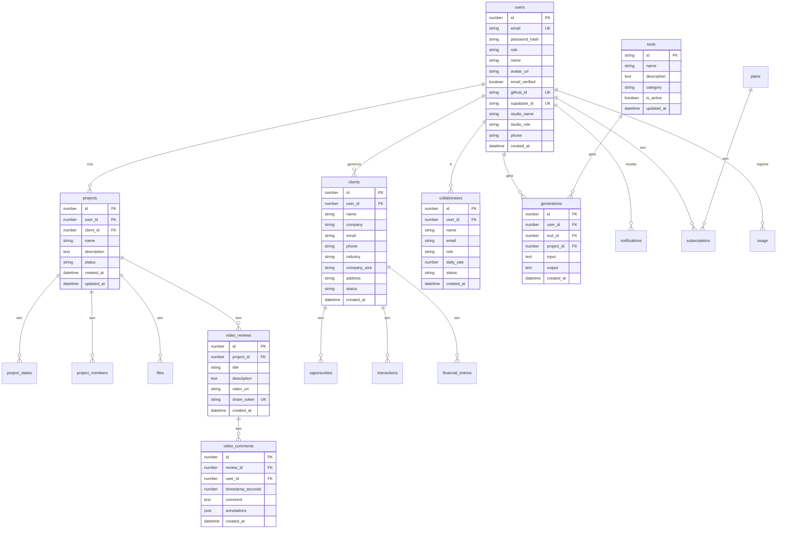

# Database Schema - Cena Studio

Diagrama e documentação do schema do banco de dados.

## 📋 Índice

- [Visão Geral](#visão-geral)
- [Diagrama ERD](#diagrama-erd)
- [Tabelas](#tabelas)
- [Relacionamentos](#relacionamentos)
- [Índices](#índices)
- [Migrations](#migrations)

---

## 🗄️ Visão Geral

### Banco de Dados Atual
- **Desenvolvimento:** SQLite (better-sqlite3)
- **Produção:** Supabase Postgres (planejado)
- **Migrations:** Preparadas em `supabase/migrations/`

### Número de Tabelas
- **Total:** 18 tabelas
- **Core:** 8 tabelas (users, projects, clients, etc.)
- **IA:** 2 tabelas (tools, generations)
- **CRM:** 4 tabelas (clients, opportunities, interactions, financial_entries)
- **Colaboração:** 3 tabelas (collaborators, project_members, video_comments)
- **Sistema:** 1 tabela (notifications, studio_settings, subscriptions, usage)

---

## 📊 Diagrama ERD



---

## 📑 Tabelas

### Core Tables

#### users
Tabela de usuários do sistema.

| Coluna | Tipo | Descrição | Restrições |
|--------|------|-----------|------------|
| id | INTEGER | ID único do usuário | PK, AUTO_INCREMENT |
| email | VARCHAR(255) | Email do usuário | UNIQUE, NOT NULL |
| password_hash | VARCHAR(255) | Hash da senha | NOT NULL |
| role | VARCHAR(50) | Papel (user, admin) | DEFAULT 'user' |
| name | VARCHAR(255) | Nome do usuário | |
| avatar_url | VARCHAR(500) | URL do avatar | |
| email_verified | BOOLEAN | Email verificado? | DEFAULT false |
| github_id | VARCHAR(255) | ID do GitHub | UNIQUE |
| supabase_id | VARCHAR(255) | ID do Supabase | UNIQUE |
| studio_name | VARCHAR(255) | Nome do estúdio | |
| studio_role | VARCHAR(100) | Papel no estúdio | |
| phone | VARCHAR(50) | Telefone | |
| created_at | DATETIME | Data de criação | DEFAULT NOW() |

#### projects
Tabela de projetos.

| Coluna | Tipo | Descrição | Restrições |
|--------|------|-----------|------------|
| id | INTEGER | ID único do projeto | PK, AUTO_INCREMENT |
| user_id | INTEGER | ID do usuário criador | FK → users.id |
| client_id | INTEGER | ID do cliente | FK → clients.id |
| name | VARCHAR(255) | Nome do projeto | NOT NULL |
| description | TEXT | Descrição | |
| status | VARCHAR(50) | Status (active, completed) | DEFAULT 'active' |
| created_at | DATETIME | Data de criação | DEFAULT NOW() |
| updated_at | DATETIME | Data de atualização | DEFAULT NOW() |

#### clients
Tabela de clientes (CRM).

| Coluna | Tipo | Descrição | Restrições |
|--------|------|-----------|------------|
| id | INTEGER | ID único do cliente | PK, AUTO_INCREMENT |
| user_id | INTEGER | ID do usuário dono | FK → users.id |
| name | VARCHAR(255) | Nome do cliente | NOT NULL |
| company | VARCHAR(255) | Empresa | |
| email | VARCHAR(255) | Email | |
| phone | VARCHAR(50) | Telefone | |
| industry | VARCHAR(100) | Indústria | |
| company_size | VARCHAR(50) | Tamanho da empresa | |
| address | TEXT | Endereço | |
| status | VARCHAR(50) | Status (lead, client, inactive) | DEFAULT 'lead' |
| created_at | DATETIME | Data de criação | DEFAULT NOW() |

#### tools
Tabela de ferramentas IA.

| Coluna | Tipo | Descrição | Restrições |
|--------|------|-----------|------------|
| id | TEXT | ID da ferramenta (`01`-`12`) | PK |
| name | VARCHAR(255) | Nome da ferramenta | NOT NULL |
| description | TEXT | Descrição | |
| category | VARCHAR(100) | Categoria | |
| is_active | BOOLEAN | Está ativa? | DEFAULT true |
| updated_at | DATETIME | Data de atualização | DEFAULT NOW() |

#### generations
Tabela de gerações IA.

| Coluna | Tipo | Descrição | Restrições |
|--------|------|-----------|------------|
| id | INTEGER | ID único da geração | PK, AUTO_INCREMENT |
| user_id | INTEGER | ID do usuário | FK → users.id |
| tool_id | INTEGER | ID da ferramenta | FK → tools.id |
| project_id | INTEGER | ID do projeto | FK → projects.id |
| input | TEXT | Input do usuário | |
| output | TEXT | Output da IA | |
| created_at | DATETIME | Data de criação | DEFAULT NOW() |

### CRM Tables

#### opportunities
Tabela de oportunidades de vendas.

| Coluna | Tipo | Descrição | Restrições |
|--------|------|-----------|------------|
| id | INTEGER | ID único | PK, AUTO_INCREMENT |
| client_id | INTEGER | ID do cliente | FK → clients.id |
| title | VARCHAR(255) | Título | NOT NULL |
| estimated_value | INTEGER | Valor estimado em centavos | |
| stage | VARCHAR(50) | Estágio do pipeline | |
| probability | INTEGER | Probabilidade (%) | |
| expected_close_date | DATE | Data esperada de fechamento | |
| created_at | DATETIME | Data de criação | DEFAULT NOW() |

#### interactions
Tabela de interações com clientes.

| Coluna | Tipo | Descrição | Restrições |
|--------|------|-----------|------------|
| id | INTEGER | ID único | PK, AUTO_INCREMENT |
| client_id | INTEGER | ID do cliente | FK → clients.id |
| type | VARCHAR(50) | Tipo (call, email, meeting) | |
| notes | TEXT | Notas | |
| subject | TEXT | Assunto | |
| next_follow_up | DATETIME | Próximo follow-up | |
| created_at | DATETIME | Data da interação | DEFAULT NOW() |

#### financial_entries
Tabela de entradas financeiras.

| Coluna | Tipo | Descrição | Restrições |
|--------|------|-----------|------------|
| id | INTEGER | ID único | PK, AUTO_INCREMENT |
| client_id | INTEGER | ID do cliente | FK → clients.id |
| kind | VARCHAR(50) | Tipo (income, expense) | |
| amount | INTEGER | Valor em centavos | |
| description | TEXT | Descrição | |
| due_date | DATE | Data de vencimento | |
| paid_at | DATETIME | Data de pagamento | |

### Collaboration Tables

#### collaborators
Tabela de colaboradores.

| Coluna | Tipo | Descrição | Restrições |
|--------|------|-----------|------------|
| id | INTEGER | ID único | PK, AUTO_INCREMENT |
| user_id | INTEGER | ID do usuário | FK → users.id |
| name | VARCHAR(255) | Nome | NOT NULL |
| email | VARCHAR(255) | Email | |
| role | VARCHAR(100) | Papel | |
| daily_rate | DECIMAL(10,2) | Diária | |
| status | VARCHAR(50) | Status (active, inactive) | DEFAULT 'active' |
| created_at | DATETIME | Data de criação | DEFAULT NOW() |

#### project_members
Tabela de membros do projeto.

| Coluna | Tipo | Descrição | Restrições |
|--------|------|-----------|------------|
| id | INTEGER | ID único | PK, AUTO_INCREMENT |
| project_id | INTEGER | ID do projeto | FK → projects.id |
| collaborator_id | INTEGER | ID do colaborador | FK → collaborators.id |
| role | VARCHAR(100) | Papel no projeto | |
| permissions | TEXT | Permissões em JSON | DEFAULT '[]' |
| created_at | DATETIME | Data de entrada | DEFAULT NOW() |
| updated_at | DATETIME | Data de atualização | DEFAULT NOW() |

#### video_reviews
Tabela de reviews de vídeo.

| Coluna | Tipo | Descrição | Restrições |
|--------|------|-----------|------------|
| id | INTEGER | ID único | PK, AUTO_INCREMENT |
| project_id | INTEGER | ID do projeto | FK → projects.id |
| title | VARCHAR(255) | Título | NOT NULL |
| description | TEXT | Descrição | |
| video_url | VARCHAR(500) | URL do vídeo | |
| share_token | VARCHAR(255) | Token de compartilhamento | UNIQUE |
| created_at | DATETIME | Data de criação | DEFAULT NOW() |

#### video_comments
Tabela de comentários em vídeos.

| Coluna | Tipo | Descrição | Restrições |
|--------|------|-----------|------------|
| id | INTEGER | ID único | PK, AUTO_INCREMENT |
| review_id | INTEGER | ID do review | FK → video_reviews.id |
| user_id | INTEGER | ID do usuário | FK → users.id |
| timestamp_seconds | DECIMAL(10,2) | Timestamp do vídeo | |
| comment | TEXT | Comentário | |
| annotations | JSON | Anotações (rectangles, etc.) | |
| created_at | DATETIME | Data de criação | DEFAULT NOW() |

### System Tables

#### notifications
Tabela de notificações.

| Coluna | Tipo | Descrição | Restrições |
|--------|------|-----------|------------|
| id | INTEGER | ID único | PK, AUTO_INCREMENT |
| user_id | INTEGER | ID do usuário | FK → users.id |
| title | VARCHAR(255) | Título | NOT NULL |
| message | TEXT | Mensagem | |
| type | VARCHAR(50) | Tipo (info, success, warning, error) | |
| read | BOOLEAN | Lido? | DEFAULT false |
| created_at | DATETIME | Data de criação | DEFAULT NOW() |

#### studio_settings
Tabela de configurações do estúdio.

| Coluna | Tipo | Descrição | Restrições |
|--------|------|-----------|------------|
| user_id | INTEGER | ID do usuário | PK, FK → users.id |
| studio_name | TEXT | Nome do estúdio | |
| legal_name | TEXT | Razão social | |
| document | TEXT | Documento fiscal | |
| email | TEXT | Email comercial | |
| phone | TEXT | Telefone | |
| city | TEXT | Cidade | |
| website | TEXT | Site | |
| signature | TEXT | Assinatura padrão | |
| primary_color | TEXT | Cor da marca | |
| created_at | DATETIME | Data de criação | DEFAULT NOW() |
| updated_at | DATETIME | Data de atualização | DEFAULT NOW() |

#### subscriptions
Tabela de assinaturas.

| Coluna | Tipo | Descrição | Restrições |
|--------|------|-----------|------------|
| id | INTEGER | ID único | PK, AUTO_INCREMENT |
| user_id | INTEGER | ID do usuário | FK → users.id |
| plan_id | INTEGER | ID do plano | FK → plans.id |
| stripe_subscription_id | VARCHAR(255) | ID no Stripe | |
| status | VARCHAR(50) | Status (active, canceled) | DEFAULT 'active' |
| current_period_end | DATETIME | Fim do período | |
| created_at | DATETIME | Data de criação | DEFAULT NOW() |

#### usage
Tabela de uso do sistema.

| Coluna | Tipo | Descrição | Restrições |
|--------|------|-----------|------------|
| id | INTEGER | ID único | PK, AUTO_INCREMENT |
| user_id | INTEGER | ID do usuário | FK → users.id |
| tool_id | TEXT | ID da ferramenta | |
| period | VARCHAR(50) | Período (YYYY-MM) | |
| count | INTEGER | Quantidade usada | DEFAULT 0 |

#### plans
Tabela de planos.

| Coluna | Tipo | Descrição | Restrições |
|--------|------|-----------|------------|
| id | TEXT | ID do plano (`free`, `pro`, `studio`) | PK |
| name | VARCHAR(100) | Nome do plano | NOT NULL |
| price_brl | INTEGER | Preço mensal em centavos | |
| generation_limit | INTEGER | Limite mensal de gerações | |
| features | TEXT | Features (JSON) | |

#### reset_tokens
Tabela de tokens de reset de senha.

| Coluna | Tipo | Descrição | Restrições |
|--------|------|-----------|------------|
| id | INTEGER | ID único | PK, AUTO_INCREMENT |
| user_id | INTEGER | ID do usuário | FK → users.id |
| token | VARCHAR(255) | Token | UNIQUE |
| expires_at | DATETIME | Data de expiração | |
| created_at | DATETIME | Data de criação | DEFAULT NOW() |

#### project_states
Tabela de estados do projeto.

| Coluna | Tipo | Descrição | Restrições |
|--------|------|-----------|------------|
| id | INTEGER | ID único | PK, AUTO_INCREMENT |
| project_id | INTEGER | ID do projeto | FK → projects.id |
| tool_id | TEXT | ID da ferramenta | NOT NULL |
| form_data | TEXT | Dados do formulário em JSON | |
| output_data | TEXT | Resultado salvo | |
| updated_at | DATETIME | Data de atualização | DEFAULT NOW() |

#### files
Tabela de arquivos.

| Coluna | Tipo | Descrição | Restrições |
|--------|------|-----------|------------|
| id | INTEGER | ID único | PK, AUTO_INCREMENT |
| project_id | INTEGER | ID do projeto | FK → projects.id |
| filename | VARCHAR(255) | Nome interno do arquivo | NOT NULL |
| original_name | VARCHAR(255) | Nome original do arquivo | NOT NULL |
| path | VARCHAR(500) | Caminho ou URL do arquivo | NOT NULL |
| size | INTEGER | Tamanho em bytes | |
| mime_type | VARCHAR(100) | Tipo MIME | |
| category | VARCHAR(100) | Categoria | |
| created_at | DATETIME | Data de upload | DEFAULT NOW() |

---

## 🔗 Relacionamentos

### users
- **1:N** projects (um usuário tem muitos projetos)
- **1:N** clients (um usuário tem muitos clientes)
- **1:N** collaborators (um usuário tem muitos colaboradores)
- **1:N** generations (um usuário tem muitas gerações)
- **1:N** notifications (um usuário tem muitas notificações)
- **1:1** subscriptions (um usuário tem uma assinatura)
- **1:N** usage (um usuário tem muitos registros de uso)

### projects
- **N:1** users (muitos projetos pertencem a um usuário)
- **N:1** clients (muitos projetos pertencem a um cliente)
- **1:N** project_states (um projeto tem muitos estados)
- **1:N** project_members (um projeto tem muitos membros)
- **1:N** files (um projeto tem muitos arquivos)
- **1:N** video_reviews (um projeto tem muitos reviews)

### clients
- **N:1** users (muitos clientes pertencem a um usuário)
- **1:N** opportunities (um cliente tem muitas oportunidades)
- **1:N** interactions (um cliente tem muitas interações)
- **1:N** financial_entries (um cliente tem muitas entradas financeiras)

### tools
- **1:N** generations (uma ferramenta gera muitas gerações)

### video_reviews
- **N:1** projects (muitos reviews pertencem a um projeto)
- **1:N** video_comments (um review tem muitos comentários)

---

## 📇 Índices

### Índices Primários
- A maioria das tabelas usa `id` como PRIMARY KEY
- `studio_settings` usa `user_id` como PRIMARY KEY

### Índices Únicos
- `users.email`
- `users.github_id`
- `users.supabase_id`
- `video_reviews.share_token`
- `reset_tokens.token`

### Índices de Performance
- `idx_users_email` ON users(email)
- `idx_projects user_id` ON projects(user_id)
- `idx_projects_client_id` ON projects(client_id)
- `idx_clients_user_id` ON clients(user_id)
- `idx_generations_user_id` ON generations(user_id)
- `idx_generations_project_id` ON generations(project_id)
- `idx_video_reviews_project_id` ON video_reviews(project_id)
- `idx_video_comments_review_id` ON video_comments(review_id)

---

## 🔄 Migrations

### Migration Inicial
**Arquivo:** `supabase/migrations/20260630010000_initial_frame_schema.sql`

**Conteúdo:**
- Criação das 18 tabelas
- Definição de foreign keys
- Criação de índices
- Seed data inicial (plans, tools, admin user, demo user)

### Aplicar Migration

```bash
# Via Supabase CLI
supabase db push

# Via SQL direto
psql -h db.vylxwhuuqluloxkhlsmd.supabase.co -U postgres -d postgres -f supabase/migrations/20260630010000_initial_frame_schema.sql
```

---

## 📊 Estatísticas

- **Total de tabelas:** 18
- **Total de colunas:** ~120
- **Total de índices:** ~20
- **Total de relacionamentos:** ~25
- **Tamanho estimado:** ~10MB (vazio)

---

**Última atualização:** 30 de Junho de 2026
